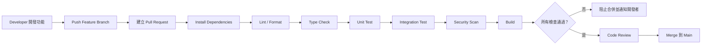
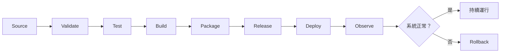
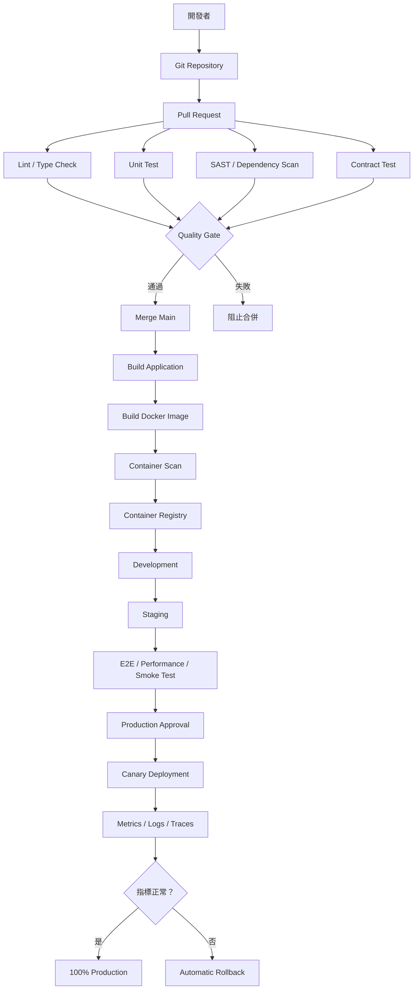
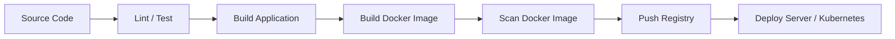
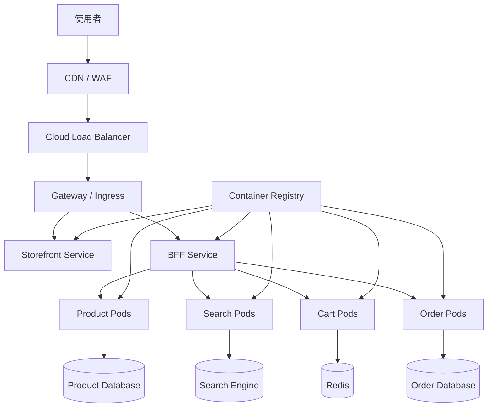
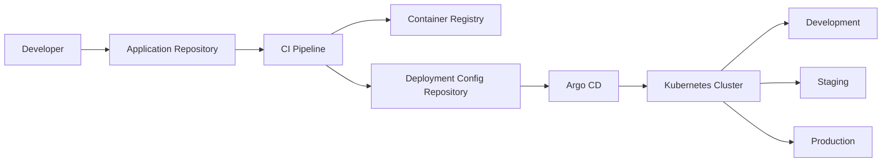
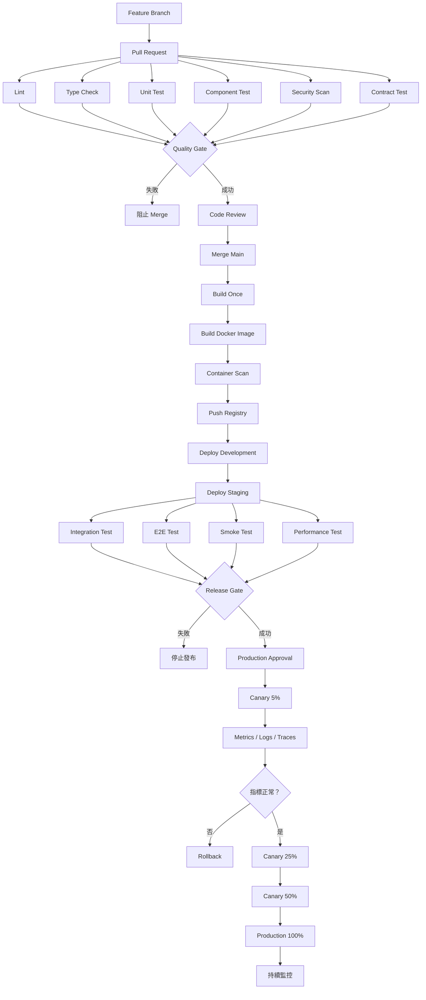

# CI/CD 完整說明：以 momo 等大型電商為例

## 一、什麼是 CI/CD？

CI/CD 並不只是某一套工具，而是一套將「程式碼整合、測試、建置、發布、部署與監控」自動化的軟體交付方法。

它主要解決以下問題：

- 開發人員的程式碼整合後才發現彼此衝突
- 人工部署容易漏步驟或設定錯誤
- 測試環境和正式環境不一致
- 發布速度太慢
- 發布失敗時無法快速回復
- 大量服務各自使用不同部署方式

---

## 1. CI：Continuous Integration，持續整合

CI 是指開發者頻繁地將程式碼合併到共同的程式碼儲存庫，並在每次 Push 或 Pull Request 時，自動執行：

1. 安裝相依套件
2. 程式碼格式檢查
3. 靜態程式碼分析
4. TypeScript 型別檢查
5. 單元測試
6. 整合測試
7. 安全性掃描
8. 專案建置

CI 的核心目的不是「自動執行指令」，而是：

> 在程式碼進入主要分支前，盡早發現程式錯誤、整合衝突與安全問題。

### CI 基本流程



例如一個 Next.js 專案，在 Pull Request 階段可能執行：

- `pnpm install --frozen-lockfile`
- `pnpm lint`
- `pnpm type-check`
- `pnpm test`
- `pnpm test:integration`
- `pnpm build`

只要其中一個步驟失敗，就不能合併到 `main`。

---

## 2. CD 的兩種意思

CD 在實務上可能代表兩種不同概念：

### Continuous Delivery：持續交付

程式碼通過 CI 後，自動：

- 建置可部署成品
- 建立 Docker Image
- 推送到 Image Registry
- 部署到測試環境或預備環境
- 執行驗收測試

但部署到正式環境前，仍需要人工審核或按下核准按鈕。

流程如下：

```text
程式碼合併
   │
   ▼
自動測試
   │
   ▼
建立 Docker Image
   │
   ▼
部署 Staging
   │
   ▼
E2E / Smoke Test
   │
   ▼
人工審核
   │
   ▼
正式環境
```

這種方式適合：

- 大型電商
- 金融系統
- 政府系統
- 涉及付款、訂單、庫存的系統
- 有嚴格稽核與變更管理需求的企業

---

### Continuous Deployment：持續部署

程式碼只要通過所有自動化檢查，就直接自動部署到正式環境，不需要人工核准。

```text
Merge Main
    │
    ▼
自動測試
    │
    ▼
建立 Artifact / Docker Image
    │
    ▼
部署 Staging
    │
    ▼
E2E / Smoke / Security Test
    │
    ▼
Canary Deployment
    │
    ▼
正式環境
```

持續部署通常需要更成熟的：

- 自動化測試
- 可觀測性
- Feature Flag
- Canary Release
- Blue-Green Deployment
- 自動回滾
- 告警系統
- 資料庫版本管理

大型電商不一定會讓所有服務都直接 Continuous Deployment。

例如：

| 系統 | 建議部署策略 |
|---|---|
| 活動頁、內容頁 | 可採持續部署 |
| 商品展示功能 | 可採 Canary Deployment |
| 推薦系統 | 可採 A/B Test 或 Canary |
| 購物車 | 建議持續交付加人工核准 |
| 訂單系統 | 建議嚴格測試與人工核准 |
| 付款系統 | 建議人工核准、灰度發布與完整稽核 |
| 庫存系統 | 需合約測試、整合測試及回滾機制 |

---

## 3. 完整 CI/CD 流程

一套相對完整的 CI/CD Pipeline，可以分成八個階段。



### 第一階段：Source

觸發條件可能是：

- Push
- Pull Request
- Merge
- Git Tag
- Release Branch
- 手動觸發
- 排程觸發

---

### 第二階段：Validate

執行：

- ESLint
- Prettier
- TypeScript Type Check
- Commit Message Check
- Dependency Validation
- API Schema Validation

目的在於找出低成本、容易辨識的問題。

---

### 第三階段：Test

測試通常分為：

#### 單元測試 Unit Test

測試單一函式、Hook、Component 或 Class。

例如：

- 折扣金額計算
- 運費計算
- 購物車總金額
- 商品資料轉換
- 表單驗證

#### 元件測試 Component Test

測試 React Component：

- 是否正確顯示商品
- 按下「加入購物車」是否觸發正確事件
- 無庫存時是否禁用按鈕
- API 失敗時是否顯示錯誤狀態

#### 整合測試 Integration Test

測試多個模組或服務能否正確合作：

```text
Cart API
   │
   ├── Product Service
   ├── Pricing Service
   ├── Inventory Service
   └── Promotion Service
```

例如加入購物車時，需要同時驗證：

- 商品是否存在
- 商品是否有庫存
- 售價是否有效
- 優惠活動是否適用
- 會員是否符合資格

#### Contract Test

確認服務之間的 API 契約沒有被破壞。

例如前端預期：

```json
{
  "productId": "P001",
  "price": 1000,
  "stockStatus": "AVAILABLE"
}
```

但後端若把 `stockStatus` 改為 `inventoryStatus`，Contract Test 就應阻止部署。

#### E2E Test

模擬使用者完整操作：

```text
搜尋商品
→ 進入商品頁
→ 選擇規格
→ 加入購物車
→ 套用優惠券
→ 填寫配送資料
→ 選擇付款方式
→ 建立訂單
```

#### 效能測試 Performance Test

測量：

- Response Time
- Throughput
- Requests Per Second
- Error Rate
- CPU 與記憶體使用率
- 高併發下的服務穩定性

#### 安全性測試 Security Test

包括：

- SAST 靜態安全掃描
- Dependency Scan
- Secret Scan
- Container Image Scan
- DAST 動態掃描
- Infrastructure as Code Scan

---

### 第四階段：Build

將原始程式碼轉換成可執行或可部署成品。

前端可能產生：

- JavaScript Bundle
- Next.js Build Output
- Static Assets
- Source Map

後端可能產生：

- Java JAR
- .NET DLL
- Node.js Production Bundle
- Go Binary

重要原則是：

> 同一份建置產物應該依序部署到測試、預備與正式環境，而不是每個環境重新 Build。

否則可能發生：

```text
Staging 測試的是 Build A
Production 實際部署的是 Build B
```

即使程式碼相同，相依套件、建置時間或環境差異仍可能造成結果不同。

---

### 第五階段：Package

將應用程式及其執行環境封裝成 Docker Image。

```text
Application Code
+ Runtime
+ Dependencies
+ System Libraries
+ Startup Command
        │
        ▼
   Docker Image
```

Docker Image 應使用不可變版本標籤，例如：

```text
momo/product-web:git-a82fd71
momo/product-api:git-a82fd71
```

不應只依賴：

```text
momo/product-api:latest
```

因為 `latest` 無法明確判斷目前實際部署的是哪一次 Commit。

---

### 第六階段：Release

將 Docker Image 推送至 Registry，例如：

- Docker Hub
- GitHub Container Registry
- AWS ECR
- Google Artifact Registry
- Azure Container Registry
- Harbor 私有 Registry

```text
CI Runner
   │
   │ docker build
   ▼
Docker Image
   │
   │ docker push
   ▼
Container Registry
```

Registry 是存放 Docker Image 的版本倉庫，不是實際執行應用程式的伺服器。

---

### 第七階段：Deploy

部署到：

- Development
- QA
- Staging
- Production

部署方式可能是：

- SSH 到 VM 執行 Docker Compose
- Kubernetes Deployment
- Helm
- Argo CD
- AWS ECS
- AWS EKS
- Google GKE
- Azure AKS
- Serverless Container Service

---

### 第八階段：Observe

部署成功不代表功能真的正常，因此部署後還要觀察：

- HTTP 5xx Error Rate
- API Response Time
- CPU
- Memory
- Pod Restart Count
- Checkout Success Rate
- Payment Success Rate
- Order Creation Success Rate
- Cart Conversion Rate
- 前端 JavaScript Error
- Core Web Vitals

若超出門檻，系統應：

1. 停止繼續部署
2. 將流量切回舊版本
3. 回滾 Deployment
4. 關閉 Feature Flag
5. 通知開發與維運人員

---

# 二、momo 等大型電商如何實踐 CI/CD？

## 1. 不能把整個電商平台當成單一部署單位

大型電商通常包含許多業務領域：

```text
大型電商平台
│
├── Web Storefront
├── Mobile Web
├── BFF
├── 商品服務
├── 搜尋服務
├── 價格服務
├── 庫存服務
├── 促銷服務
├── 購物車服務
├── 訂單服務
├── 會員服務
├── 支付服務
├── 物流服務
└── 推薦服務
```

每一個服務應有自己的：

- Build
- Test
- Docker Image
- Deployment
- Version
- Monitoring
- Rollback

但可以共用企業級 Pipeline Template，避免每個團隊自行建立完全不同的部署規則。

---

## 2. 大型電商 CI/CD 架構



---

## 3. Pull Request Pipeline

開發者建立 Pull Request 時，先執行速度較快的檢查：

```text
Pull Request
├── Install Dependencies
├── Lint
├── Type Check
├── Unit Test
├── Component Test
├── API Contract Test
├── Dependency Scan
└── Build Verification
```

目標是讓開發者在數分鐘內得到回饋。

不應把所有耗時一小時的壓力測試都放在每次 Pull Request，否則團隊會因等待時間太長而逃避 CI。

可採分層策略：

| Pipeline | 觸發時機 | 測試內容 |
|---|---|---|
| PR Pipeline | 每次 Pull Request | Lint、型別、單元、元件、快速整合測試 |
| Main Pipeline | Merge Main | 完整整合測試、Image Scan、部署 Staging |
| Release Pipeline | Release Candidate | E2E、效能、安全、回歸測試 |
| Scheduled Pipeline | 每晚或每週 | 完整測試、長時間壓力測試 |
| Production Pipeline | 正式發布 | Smoke Test、Canary、監控與回滾 |

---

## 4. Monorepo 的 CI/CD 最佳化

假設大型前端 Monorepo 如下：

```text
apps/
├── storefront
├── member-center
├── checkout
├── seller-center
└── admin

packages/
├── ui
├── auth
├── analytics
├── api-client
├── eslint-config
└── types
```

不應每次只修改 `checkout`，卻重新測試與部署所有應用。

應使用 Turborepo、Nx 或其他變更影響分析機制：

```text
Git Diff
   │
   ▼
辨識受影響的 App / Package
   │
   ├── checkout 有變更
   ├── ui 有變更
   └── storefront 無影響
          │
          ▼
只建置與測試受影響專案
```

例如修改共用 UI：

```text
packages/ui
   ├── 影響 storefront
   ├── 影響 member-center
   └── 影響 checkout
```

Pipeline 才需要測試這三個應用。

這能降低：

- CI 執行時間
- Runner 成本
- 無意義的部署
- 大型 Monorepo 的等待時間

---

## 5. 大型電商不宜直接一次更新全部正式流量

大型電商適合採用以下部署策略。

### Rolling Update

逐批用新版本取代舊版本：

```text
開始：
V1 V1 V1 V1

更新中：
V2 V1 V1 V1

更新中：
V2 V2 V1 V1

完成：
V2 V2 V2 V2
```

優點：

- 不需要一次停止所有服務
- Kubernetes 原生支援
- 適合一般服務更新

風險：

- 新舊版本會短暫同時存在
- API 與資料庫必須向前、向後相容

---

### Blue-Green Deployment

同時維持兩套環境：

```text
                 ┌── Blue：Version 1
User → Load Balancer
                 └── Green：Version 2
```

先將 Version 2 部署到 Green，確認正常後再切換流量：

```text
切換前：100% → Blue
切換後：100% → Green
```

優點：

- 切換快速
- 回滾快速

缺點：

- 需要接近兩倍運算資源
- 資料庫變更仍需額外處理

---

### Canary Deployment

先讓少量使用者使用新版本：

```text
第一階段：
95% → Version 1
 5% → Version 2

第二階段：
75% → Version 1
25% → Version 2

第三階段：
 0% → Version 1
100% → Version 2
```

Canary 階段觀察：

- HTTP 5xx
- P95 / P99 Response Time
- CPU 與 Memory
- 加入購物車成功率
- 結帳成功率
- 訂單建立成功率
- 支付成功率

若 Version 2 指標惡化，立即停止擴大流量並回滾。

---

## 6. 高流量活動期間的發布管制

例如雙 11、雙 12 或大型促銷活動期間，不應和平常一樣自由部署。

可建立 Freeze Window：

```text
活動前 7 天
├── 限制高風險功能變更
├── 完成壓力測試
├── 完成容量規劃
└── 準備回滾與降級方案

活動期間
├── 一般功能禁止部署
├── 僅允許緊急 Hotfix
├── 需要多人審核
└── 強化監控與值班

活動後
├── 恢復一般部署
└── 執行事故與效能檢討
```

緊急 Hotfix 仍必須至少通過：

- 關鍵單元測試
- Build
- 安全掃描
- Smoke Test
- 人工審核
- Canary Deployment

不能因為緊急，就完全繞過所有品質關卡。

---

# 三、沒有執行各項測試，仍算完整的 CI/CD 嗎？

## 結論

> 技術形式上可能仍有自動整合與自動部署，但工程品質上不能稱為完整、成熟或可信賴的 CI/CD。

例如下面流程：

```text
Push
→ Build
→ Deploy Production
```

這可以被稱為一條「自動部署 Pipeline」，甚至具備狹義的 CD 形式，但缺少 CI/CD 最重要的品質回饋與風險控制。

---

## 為什麼沒有測試不能算完整？

CI 的核心是持續驗證程式碼能否安全整合。

如果完全沒有測試，Pipeline 只能證明：

- 程式碼可能可以編譯
- Docker Image 可能可以建立
- 檔案可能可以部署

它無法證明：

- 功能正確
- 舊功能未被破壞
- API 相容
- 沒有安全漏洞
- 系統能承受流量
- 使用者可以完成結帳
- 訂單與付款狀態一致

因此：

```text
自動化部署 ≠ 完整 CI/CD
```

---

## 最低限度的 CI 品質門檻

即使是小型專案，也建議至少加入：

```text
Pull Request
├── Lint
├── Type Check
├── Unit Test
├── Build
└── Dependency Security Scan
```

正式部署後至少加入：

```text
Production Deployment
├── Health Check
├── Smoke Test
├── Error Monitoring
└── Rollback Mechanism
```

---

## 不需要每次執行所有測試

「完整 CI/CD」不代表每次 Commit 都執行所有測試，而是依風險與成本建立不同層級。

```text
每次 Commit
├── Lint
├── Type Check
└── Unit Test

每次 Merge
├── Integration Test
├── Contract Test
└── Build Docker Image

部署 Staging
├── E2E Test
├── Smoke Test
└── Security Test

重大 Release
├── Performance Test
├── Load Test
├── Regression Test
└── Disaster Recovery Verification
```

真正重要的是：

> 在程式碼進入下一個環境前，必須有與其風險相符的驗證關卡。

---

## 測試失敗時應阻止後續流程

錯誤做法：

```text
Unit Test 失敗
      │
      ▼
仍然 Build
      │
      ▼
仍然 Deploy Production
```

正確做法：

```text
Unit Test 失敗
      │
      ▼
Pipeline Failed
      │
      ├── 阻止 Merge
      ├── 阻止建立正式 Release
      └── 通知開發人員
```

測試如果只是產生報告，但失敗後仍允許部署，就不是有效的 Quality Gate。

---

# 四、如何在 CI/CD 中加入 Docker 與其他伺服器服務？

## 1. Docker 在 CI/CD 中的位置

Docker 通常位於「測試完成」與「部署」之間：



Docker 的作用是把：

- 程式碼
- Runtime
- 系統套件
- 相依套件
- 啟動指令

封裝成一致的 Image。

因此可降低：

```text
我的電腦可以執行
但測試機不能執行
正式機又是另一種結果
```

---

## 2. Dockerfile 範例：Next.js

```dockerfile
# Build Stage
FROM node:22-alpine AS builder

WORKDIR /app

COPY package.json pnpm-lock.yaml ./

RUN corepack enable
RUN pnpm install --frozen-lockfile

COPY . .

RUN pnpm build

# Runtime Stage
FROM node:22-alpine AS runner

WORKDIR /app

ENV NODE_ENV=production

COPY --from=builder /app/public ./public
COPY --from=builder /app/.next/standalone ./
COPY --from=builder /app/.next/static ./.next/static

USER node

EXPOSE 3000

CMD ["node", "server.js"]
```

這是 Multi-stage Build：

```text
Builder Image
├── 原始碼
├── 開發相依套件
└── Build Tools
       │
       ▼
產生 Build Output
       │
       ▼
Runtime Image
├── 執行環境
├── Production Output
└── 必要相依套件
```

優點：

- 正式 Image 較小
- 不包含不必要的開發工具
- 降低攻擊面
- 啟動與傳輸速度較快

---

## 3. GitHub Actions Pipeline 範例

```yaml
name: ecommerce-ci-cd

on:
  pull_request:
    branches:
      - main

  push:
    branches:
      - main

env:
  IMAGE_NAME: ghcr.io/example/storefront

jobs:
  test:
    name: Test Application
    runs-on: ubuntu-latest

    steps:
      - name: Checkout
        uses: actions/checkout@v4

      - name: Setup pnpm
        uses: pnpm/action-setup@v4
        with:
          version: 10

      - name: Setup Node.js
        uses: actions/setup-node@v4
        with:
          node-version: 22
          cache: pnpm

      - name: Install dependencies
        run: pnpm install --frozen-lockfile

      - name: Lint
        run: pnpm lint

      - name: Type check
        run: pnpm type-check

      - name: Unit test
        run: pnpm test

      - name: Build
        run: pnpm build

  docker:
    name: Build and Push Docker Image
    if: github.event_name == 'push'
    needs:
      - test

    runs-on: ubuntu-latest

    permissions:
      contents: read
      packages: write

    steps:
      - name: Checkout
        uses: actions/checkout@v4

      - name: Login to Container Registry
        uses: docker/login-action@v3
        with:
          registry: ghcr.io
          username: ${{ github.actor }}
          password: ${{ secrets.GITHUB_TOKEN }}

      - name: Setup Docker Buildx
        uses: docker/setup-buildx-action@v3

      - name: Build and push image
        uses: docker/build-push-action@v6
        with:
          context: .
          push: true
          tags: |
            ${{ env.IMAGE_NAME }}:${{ github.sha }}
            ${{ env.IMAGE_NAME }}:main
          cache-from: type=gha
          cache-to: type=gha,mode=max

  deploy-staging:
    name: Deploy to Staging
    needs:
      - docker

    runs-on: ubuntu-latest
    environment: staging

    steps:
      - name: Checkout
        uses: actions/checkout@v4

      - name: Configure Kubernetes
        run: |
          mkdir -p ~/.kube
          echo "${{ secrets.KUBE_CONFIG_STAGING }}" \
            | base64 --decode > ~/.kube/config

      - name: Update Kubernetes image
        run: |
          kubectl set image deployment/storefront \
            storefront=${{ env.IMAGE_NAME }}:${{ github.sha }} \
            --namespace=staging

      - name: Wait for rollout
        run: |
          kubectl rollout status deployment/storefront \
            --namespace=staging \
            --timeout=180s

      - name: Smoke test
        run: |
          curl --fail --retry 5 \
            https://staging.example.com/health

  deploy-production:
    name: Deploy to Production
    needs:
      - deploy-staging

    runs-on: ubuntu-latest
    environment: production

    steps:
      - name: Checkout
        uses: actions/checkout@v4

      - name: Configure Kubernetes
        run: |
          mkdir -p ~/.kube
          echo "${{ secrets.KUBE_CONFIG_PRODUCTION }}" \
            | base64 --decode > ~/.kube/config

      - name: Deploy production
        run: |
          kubectl set image deployment/storefront \
            storefront=${{ env.IMAGE_NAME }}:${{ github.sha }} \
            --namespace=production

      - name: Verify rollout
        run: |
          kubectl rollout status deployment/storefront \
            --namespace=production \
            --timeout=300s
```

`environment: production` 可以搭配：

- Required Reviewers
- Branch Restrictions
- Environment Secrets
- Deployment Protection Rules

使正式部署必須經過授權人員核准。

---

## 4. Docker 搭配單一伺服器

小型或內部系統可以使用：

```text
GitHub Actions
      │
      ▼
Container Registry
      │
      ▼
Linux VM
      │
      └── Docker Compose
             ├── Web Container
             ├── API Container
             ├── Nginx Container
             └── Redis Container
```

`compose.yaml`：

```yaml
services:
  web:
    image: ghcr.io/example/storefront:${IMAGE_TAG}
    restart: always
    environment:
      API_URL: http://api:8080
    depends_on:
      - api

  api:
    image: ghcr.io/example/store-api:${IMAGE_TAG}
    restart: always
    environment:
      REDIS_URL: redis://redis:6379
      DATABASE_URL: ${DATABASE_URL}
    depends_on:
      - redis

  redis:
    image: redis:7-alpine
    restart: always

  nginx:
    image: nginx:alpine
    restart: always
    ports:
      - "80:80"
      - "443:443"
    depends_on:
      - web
```

部署指令可能是：

```bash
docker compose pull
docker compose up -d
docker compose ps
```

適合：

- 小型專案
- 內部管理系統
- 流量不高的服務
- 初期 MVP

不適合直接承擔大型電商全部核心服務，因為：

- 單機容易成為單點故障
- 擴充能力有限
- 滾動更新較難
- 大量容器管理困難
- 故障轉移能力不足

---

## 5. Docker 搭配 Kubernetes

大型電商更可能採用容器編排平台：



Kubernetes 各元件的角色：

| 元件 | 作用 |
|---|---|
| Pod | 執行一個或多個 Container |
| Deployment | 管理 Pod 數量、更新與回滾 |
| Service | 為 Pod 提供固定的內部存取位置 |
| Gateway／Ingress | 將外部 HTTP 流量導入不同服務 |
| ConfigMap | 儲存非機密設定 |
| Secret | 儲存密碼、Token、憑證等機密 |
| HPA | 根據負載自動調整 Pod 數量 |
| PersistentVolume | 提供持久化儲存 |
| Namespace | 隔離不同環境或系統 |
| Helm | 管理 Kubernetes 部署模板 |

---

## 6. Docker 搭配其他基礎設施

完整架構可能是：

```text
Internet
   │
   ▼
DNS
   │
   ▼
CDN + WAF
   │
   ▼
Load Balancer
   │
   ▼
Kubernetes Gateway
   │
   ├── Frontend Container
   ├── BFF Container
   ├── Product Service Container
   ├── Cart Service Container
   ├── Order Service Container
   └── Payment Service Container
          │
          ├── Redis
          ├── Message Queue
          ├── Relational Database
          ├── Search Engine
          └── Object Storage
```

### CDN

用途：

- 快取圖片、JavaScript、CSS
- 降低 Origin Server 流量
- 加速不同地區使用者載入速度

### WAF

用途：

- 阻擋惡意請求
- SQL Injection 防護
- XSS 防護
- Bot 與異常流量控制

### Load Balancer

用途：

- 將流量分配到多個節點
- Health Check
- TLS Termination
- 避免單一伺服器過載

### Redis

用途：

- Session
- Cache
- 購物車暫存
- Rate Limiting
- Distributed Lock

Redis 不應把重要資料只存在記憶體而完全沒有持久化或資料庫備援。

### Message Queue

例如 Kafka、RabbitMQ 或雲端訊息服務。

適合處理：

```text
建立訂單
   │
   ├── 發送訂單事件
   ├── 通知庫存服務
   ├── 通知物流服務
   ├── 通知會員服務
   ├── 發送 Email / SMS
   └── 更新分析資料
```

避免使用者必須同步等待全部工作完成。

### Database

正式環境的資料庫通常不建議和應用程式一起當作普通無狀態 Container 隨意重建。

大型系統通常使用：

- Managed Database
- Database Cluster
- Primary / Replica
- Automated Backup
- Point-in-Time Recovery

### Object Storage

用於：

- 商品圖片
- 發票檔案
- 匯出報表
- 使用者上傳內容

不應把使用者上傳檔案只存放在 Container 內，因為 Container 被替換後資料可能消失。

---

## 7. Kubernetes Deployment 範例

```yaml
apiVersion: apps/v1
kind: Deployment

metadata:
  name: storefront
  namespace: production

spec:
  replicas: 4

  strategy:
    type: RollingUpdate
    rollingUpdate:
      maxSurge: 1
      maxUnavailable: 0

  selector:
    matchLabels:
      app: storefront

  template:
    metadata:
      labels:
        app: storefront

    spec:
      containers:
        - name: storefront
          image: ghcr.io/example/storefront:git-a82fd71

          ports:
            - containerPort: 3000

          readinessProbe:
            httpGet:
              path: /api/ready
              port: 3000
            initialDelaySeconds: 5
            periodSeconds: 10

          livenessProbe:
            httpGet:
              path: /api/health
              port: 3000
            initialDelaySeconds: 15
            periodSeconds: 20

          resources:
            requests:
              cpu: 250m
              memory: 256Mi
            limits:
              cpu: "1"
              memory: 1Gi
```

### Readiness Probe

判斷 Container 是否準備好接收流量。

若失敗：

```text
Pod 繼續執行
但 Service 暫時不把流量送給它
```

### Liveness Probe

判斷應用程式是否已經失去正常運作能力。

若持續失敗：

```text
Kubernetes 重新啟動 Container
```

兩者不能混為一談，否則可能造成：

- 尚未完成初始化就被重啟
- 發生外部依賴問題時所有 Pod 同時重啟
- Deployment 永遠無法完成

---

## 8. 自動擴縮

大型促銷活動會有明顯流量波動，可以設定 HPA：

```yaml
apiVersion: autoscaling/v2
kind: HorizontalPodAutoscaler

metadata:
  name: storefront-hpa
  namespace: production

spec:
  scaleTargetRef:
    apiVersion: apps/v1
    kind: Deployment
    name: storefront

  minReplicas: 4
  maxReplicas: 40

  metrics:
    - type: Resource
      resource:
        name: cpu
        target:
          type: Utilization
          averageUtilization: 60
```

概念如下：

```text
一般流量：
4 Pods

流量上升：
8 Pods

促銷高峰：
20～40 Pods

流量下降：
逐步降回 4 Pods
```

但不能只依賴 CPU，電商服務也可考慮：

- Requests Per Second
- Queue Length
- Response Time
- Active Connections
- Kafka Consumer Lag
- 自訂商業指標

---

## 9. CI/CD 不應直接管理正式機密

錯誤做法：

```yaml
env:
  DB_PASSWORD: my-real-password
```

也不應：

- 把 `.env.production` Commit 到 Git
- 把雲端金鑰寫進 Dockerfile
- 把密碼 Build 進 Docker Image
- 在 Log 中印出 Token

正確做法是使用：

- GitHub Actions Secrets
- Kubernetes Secrets
- HashiCorp Vault
- AWS Secrets Manager
- Google Secret Manager
- Azure Key Vault

更成熟的方式是使用短期身分驗證，例如 OIDC，避免在 CI 平台長期保存雲端 Access Key。

---

## 10. GitOps 架構

大型系統可以將 CI 與 CD 分離。

### CI 負責

```text
程式碼測試
→ Build
→ 建立 Docker Image
→ 安全掃描
→ Push Registry
→ 更新部署設定版本
```

### Argo CD 等 CD 工具負責

```text
監控 Deployment Repository
→ 比較 Git Desired State
→ 比較 Kubernetes Actual State
→ 自動同步
→ 部署
→ 回復設定漂移
```

架構如下：



GitOps 的優點：

- Git 保留部署版本紀錄
- 可以審查基礎設施變更
- CI 不需要直接對正式 Cluster 執行大量指令
- 容易查出誰在什麼時間部署什麼版本
- 可以降低環境設定漂移

---

# 五、大型電商建議的完整 Pipeline



---

# 六、總結

## CI/CD 的核心不是「有一個 YAML 檔案」

真正完整的 CI/CD 應包含：

1. 自動觸發
2. 程式碼品質檢查
3. 自動化測試
4. 可重現的 Build
5. 不可變的部署成品
6. 不同環境的發布流程
7. 安全性檢查
8. 部署審核或自動化 Quality Gate
9. 灰度發布
10. 部署後監控
11. 失敗回滾
12. 稽核紀錄

---

## 沒有測試的 Pipeline

```text
Push → Build → Deploy
```

只能說是：

- 自動建置流程
- 自動部署流程
- 初階 Pipeline

不能稱為成熟且可信賴的 CI/CD。

---

## Docker 的角色

Docker 解決的是：

```text
如何把應用程式及執行環境封裝成一致的部署單位
```

它本身不負責：

- 決定何時部署
- 管理大量伺服器
- 分配外部流量
- 自動擴縮
- 完整監控
- 決定是否回滾

因此通常需要搭配：

```text
GitHub Actions / GitLab CI / Jenkins
                +
Container Registry
                +
Kubernetes / ECS / VM
                +
Load Balancer / Gateway
                +
Database / Redis / Message Queue
                +
Monitoring / Logging / Tracing
```

---

## 大型電商最重要的原則

> 大型電商 CI/CD 的目標不是追求「最快把程式部署上線」，而是在高頻率交付的同時，控制訂單、付款、庫存與使用者體驗的風險。

因此成熟的流程應做到：

```text
快速回饋
+ 自動驗證
+ 分階段部署
+ 即時監控
+ 快速回滾
+ 完整稽核
```