# Turborepo、pnpm 與 momo 大型電商 Monorepo 架構設計

> 本文說明：
>
> 1. 為什麼 Turborepo 經常搭配 pnpm
> 2. momo 大型電商 Monorepo 應如何設計
> 3. Monorepo 如何結合高流量、高併發與 Micro Frontend

---

# 一、為什麼 Turborepo 建議搭配 pnpm？

## 1. Turborepo 與 pnpm 解決不同問題

Turborepo 並不是 Package Manager，而 pnpm 也不是 Build System。

兩者的責任如下：

| 工具                  | 主要責任                                         |
| ------------------- | -------------------------------------------- |
| pnpm                | 安裝依賴、管理 Workspace、連結內部套件、維護 Lockfile         |
| Turborepo           | 管理 Build、Test、Lint、Type Check、Task Graph 與快取 |
| Next.js             | 網頁渲染、Routing、SSR、SSG、ISR 與 BFF               |
| Docker / Kubernetes | 部署、容器管理、水平擴展與故障復原                            |

## 架構圖：pnpm 與 Turborepo 的責任分工

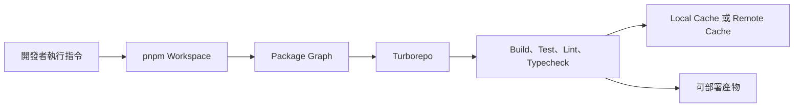

簡單來說：

```text
pnpm 管理「有哪些專案、套件與依賴」

Turborepo 管理「這些專案的任務要按照什麼順序執行」
```

---

## 2. Turborepo 並沒有強制使用 pnpm

Turborepo 可以搭配：

* npm Workspaces
* Yarn Workspaces
* pnpm Workspaces
* Bun Workspaces

因此，正確說法不是：

```text
Turborepo 一定要使用 pnpm
```

而是：

```text
在大型 Monorepo 中，pnpm 通常是較適合搭配 Turborepo 的選項
```

主要原因包括：

1. pnpm 原生支援 Workspace
2. 提供嚴格的依賴隔離
3. 支援 `workspace:` Protocol
4. 降低重複套件占用的磁碟空間
5. 適合大量 Package 的 Filter 操作
6. 可以提供 Turborepo 清楚的 Package Graph

---

## 3. pnpm Workspace 負責建立 Monorepo 套件關係

根目錄可以透過 `pnpm-workspace.yaml` 定義 Workspace：

```yaml
packages:
  - "apps/*"
  - "packages/*"
  - "tooling/*"
```

例如：

```text
momo-commerce/
├── apps/
│   ├── storefront/
│   ├── campaign/
│   ├── checkout/
│   └── member/
│
├── packages/
│   ├── ui/
│   ├── auth/
│   ├── api-client/
│   └── observability/
│
└── pnpm-workspace.yaml
```

pnpm 會將這些目錄視為同一個 Workspace 中的獨立 Package。

---

## 4. `workspace:` Protocol 可避免誤用外部版本

例如 `apps/checkout/package.json`：

```json
{
  "dependencies": {
    "@momo/ui": "workspace:*",
    "@momo/auth": "workspace:*",
    "@momo/api-client": "workspace:*"
  }
}
```

`workspace:*` 表示：

> 這個 Application 必須使用目前 Monorepo 中的本地 Package。

它可以避免以下問題：

```text
開發者以為使用本地的 @momo/ui
                ↓
實際安裝到 Registry 上的舊版本
                ↓
本機、CI 與正式環境出現版本差異
```

---

## 5. pnpm 可減少重複套件與磁碟占用

傳統專案可能在每個 Application 中重複安裝相同依賴：

```text
storefront/node_modules/react
checkout/node_modules/react
member/node_modules/react
campaign/node_modules/react
```

pnpm 使用 Content-addressable Store，套件實體內容通常只需要儲存一次，再連結到不同專案。

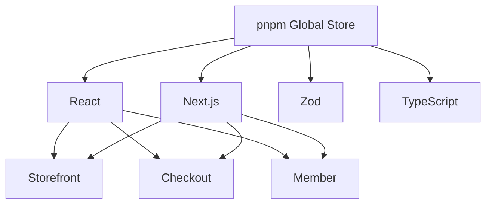

對大型 Monorepo 而言，可以：

* 減少磁碟使用量
* 加速套件安裝
* 提升 CI 安裝效率
* 降低重複依賴成本

---

## 6. pnpm 可降低 Phantom Dependency 問題

所謂 Phantom Dependency，是指某個 Package 沒有明確宣告依賴，卻因為依賴被提升到上層而可以意外使用。

例如：

```ts
import lodash from "lodash";
```

但該專案的 `package.json` 並沒有宣告：

```json
{
  "dependencies": {
    "lodash": "..."
  }
}
```

可能造成：

```text
本機剛好可以執行
        ↓
CI 重新安裝依賴
        ↓
套件目錄結構不同
        ↓
Build 失敗
```

pnpm 採用較嚴格的依賴隔離，可以提早發現錯誤依賴。

---

## 7. Turborepo 使用 Package Graph 決定建置順序

假設：

```text
apps/storefront
    ↓
packages/commerce-components
    ↓
packages/ui
    ↓
packages/design-tokens
```

對應的建置順序為：

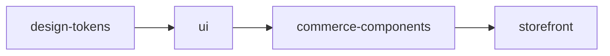

如果只修改 `packages/ui`，Turborepo 可以判斷需要重新執行：

```text
packages/ui
packages/commerce-components
apps/storefront
```

不需要重新建置與其無關的：

```text
apps/merchant
apps/cms
apps/customer-service
```

---

## 8. Turborepo 提供 Task Graph 與快取

`turbo.json` 範例：

```json
{
  "$schema": "https://turborepo.com/schema.json",
  "tasks": {
    "build": {
      "dependsOn": ["^build"],
      "outputs": [
        ".next/**",
        "dist/**",
        "!.next/cache/**"
      ]
    },
    "lint": {
      "dependsOn": ["^lint"]
    },
    "typecheck": {
      "dependsOn": ["^typecheck"]
    },
    "test": {
      "dependsOn": ["^build"],
      "outputs": ["coverage/**"]
    },
    "dev": {
      "cache": false,
      "persistent": true
    }
  }
}
```

其中：

```json
{
  "dependsOn": ["^build"]
}
```

表示先完成上游依賴的 Build，再建置目前 Package。

---

# 二、momo 大型電商 Monorepo 應如何設計？

## 1. 不能只建立一個超大型 Web Application

以下設計雖然把所有功能放進同一個 Repository，但本質上仍是一個 Frontend Monolith：

```text
apps/web/
├── product/
├── search/
├── cart/
├── checkout/
├── payment/
├── member/
├── campaign/
├── merchant/
└── cms/
```

可能造成：

* 修改小功能也要建置整個網站
* 所有團隊共用相同部署週期
* Checkout 問題可能影響商品頁
* Bundle 持續膨脹
* CI/CD 時間愈來愈長
* 團隊責任邊界模糊
* 發布風險集中

大型電商應優先依照 **Business Domain** 拆分，而不是只依照技術檔案類型拆分。

---

## 2. momo Monorepo 建議目錄

```text
momo-commerce-platform/
│
├── apps/
│   ├── storefront/            # 首頁、分類、搜尋、商品頁
│   ├── campaign/              # 雙 11、周年慶、品牌活動
│   ├── checkout/              # 購物車、結帳、付款
│   ├── member/                # 登入、會員、訂單紀錄
│   ├── merchant/              # 商家與供應商後台
│   ├── cms/                   # 營運內容管理
│   ├── customer-service/      # 客服、退款、退換貨
│   └── storybook/             # 元件展示與文件
│
├── packages/
│   ├── design-tokens/
│   ├── ui/
│   ├── commerce-components/
│   ├── checkout-components/
│   ├── auth/
│   ├── api-client/
│   ├── api-contracts/
│   ├── analytics/
│   ├── observability/
│   ├── feature-flags/
│   ├── i18n/
│   ├── seo/
│   ├── security/
│   └── testing/
│
├── tooling/
│   ├── eslint-config/
│   ├── typescript-config/
│   ├── prettier-config/
│   ├── vitest-config/
│   └── playwright-config/
│
├── pnpm-workspace.yaml
├── turbo.json
├── package.json
└── pnpm-lock.yaml
```

---

## 3. momo Monorepo 整體分層

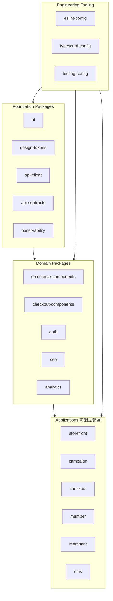

這張圖的核心概念是：

```text
Applications
依賴 Domain Packages

Domain Packages
依賴 Foundation Packages

底層套件不可以反向依賴上層 Application
```

---

## 4. `apps` 與 `packages` 的差異

### apps

`apps` 是可以獨立啟動、建置與部署的系統。

例如：

```text
apps/storefront
apps/checkout
apps/member
```

每個 App 可以擁有自己的：

* Runtime
* 環境變數
* CI/CD Pipeline
* Docker Image
* Kubernetes Deployment
* Auto Scaling Policy
* Release Schedule
* Error Budget

### packages

`packages` 是提供其他 App 重用的內部套件。

例如：

```text
@momo/ui
@momo/auth
@momo/api-client
@momo/analytics
@momo/observability
```

它們通常不應該直接成為對外服務。

---

## 5. 共用套件應分層，不應全部放進 `shared`

不建議：

```text
packages/shared/
├── components/
├── api/
├── auth/
├── state/
├── utils/
├── business/
└── other/
```

因為最後容易形成另一個大型 Shared Monolith。

建議分層：

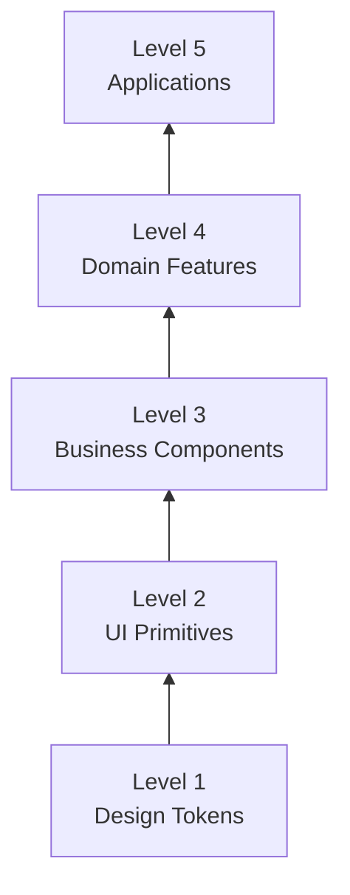

### Level 1：Design Tokens

```text
@momo/design-tokens
```

包含：

* Color
* Typography
* Spacing
* Breakpoint
* Border
* Shadow

### Level 2：UI Primitives

```text
@momo/ui
```

包含：

* Button
* Input
* Modal
* Drawer
* Tabs
* Skeleton
* Dialog

### Level 3：Business Components

```text
@momo/commerce-components
```

包含：

* ProductCard
* PriceDisplay
* PromotionBadge
* CouponCard
* RatingSummary

### Level 4：Domain Features

```text
@momo/cart-feature
@momo/search-feature
@momo/member-feature
```

包含：

* Domain API
* Business Rules
* Domain State
* Feature-specific Components

### Level 5：Applications

```text
apps/storefront
apps/checkout
apps/member
```

包含：

* Routing
* Page Composition
* Application State
* Runtime Configuration
* Deployment Configuration

---

## 6. 建立單向 Dependency Rule

建議方向：

```text
Application
    ↓
Domain Feature
    ↓
Business Component
    ↓
UI Primitive
    ↓
Design Token
```

禁止以下反向依賴：

```text
packages/ui
    ↓
apps/checkout
```

或：

```text
packages/design-tokens
    ↓
packages/commerce-components
```

可以建立以下規則：

```text
packages/ui 不得 import apps/*

packages/design-tokens 不得 import packages/ui

packages/api-contracts 不得依賴 React

apps/checkout 不得直接 import apps/storefront

apps/member 不得直接讀取 checkout 的內部 State
```

可搭配：

* ESLint `no-restricted-imports`
* Turborepo Boundaries
* Dependency Cruiser
* CODEOWNERS
* CI Architecture Test

---

# 三、Monorepo 如何結合 Micro Frontend？

## 1. 三種架構處理不同問題

| 架構                   | 主要解決問題             |
| -------------------- | ------------------ |
| Monorepo             | 程式碼、套件、規範與依賴管理     |
| Micro Frontend       | 團隊邊界、獨立部署、故障隔離     |
| CDN、Kubernetes、Cache | 高流量、高併發與可用性        |
| BFF                  | API 聚合、快取與前端專用資料模型 |

## 架構圖：三者的關係

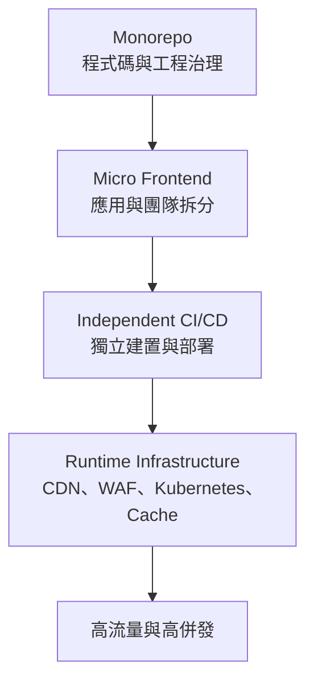

重要觀念：

```text
Monorepo 不直接處理流量

Monorepo 讓各個高流量 Application
可以被一致地開發、測試、建置及部署
```

---

## 2. momo 建議依照 Business Domain 拆分 Micro Frontend

| Micro Frontend | 負責範圍          |
| -------------- | ------------- |
| Storefront     | 首頁、分類、搜尋、商品頁  |
| Campaign       | 雙 11、周年慶、品牌活動 |
| Checkout       | 購物車、結帳、付款     |
| Member         | 登入、會員、訂單查詢    |
| Merchant       | 商家與供應商後台      |
| CMS            | 營運與內容管理       |

不建議拆成：

```text
Header Micro Frontend
Footer Micro Frontend
Button Micro Frontend
Banner Micro Frontend
```

因為切得太細會增加：

* Runtime Network Request
* 版本相容問題
* 跨模組 State 同步問題
* Debug 難度
* React 重複載入風險
* Observability 複雜度

合理的 Micro Frontend 邊界應同時符合：

```text
Business Capability
+
Team Ownership
+
Independent Deployment
+
Failure Isolation
```

---

## 3. 優先採用 Route-based Micro Frontend

momo 可按照 URL Path 分配不同 Application：

```text
www.momoshop.com.tw/
www.momoshop.com.tw/category/*
www.momoshop.com.tw/product/*
    → Storefront App

www.momoshop.com.tw/campaign/*
    → Campaign App

www.momoshop.com.tw/cart/*
www.momoshop.com.tw/checkout/*
    → Checkout App

www.momoshop.com.tw/member/*
    → Member App
```

## 架構圖：momo Route-based Micro Frontend

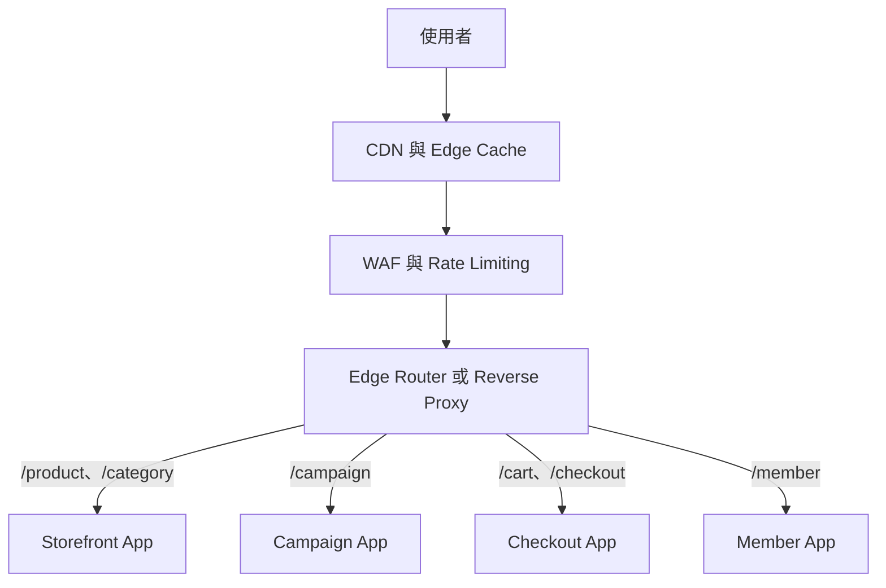

優點：

* 各 App 可以獨立部署
* 各 App 可以獨立擴展
* 故障範圍較容易隔離
* 團隊責任較清楚
* SSR 與 SEO 架構較單純
* 不需要在 Browser 動態載入大量 Remote Module

可使用：

* Next.js Multi-Zones
* CDN Path Routing
* Reverse Proxy
* Kubernetes Ingress
* API Gateway

---

## 4. Component-based Micro Frontend 應謹慎使用

若同一頁面內，部分區塊必須由不同團隊獨立發布，才考慮 Module Federation。

例如：

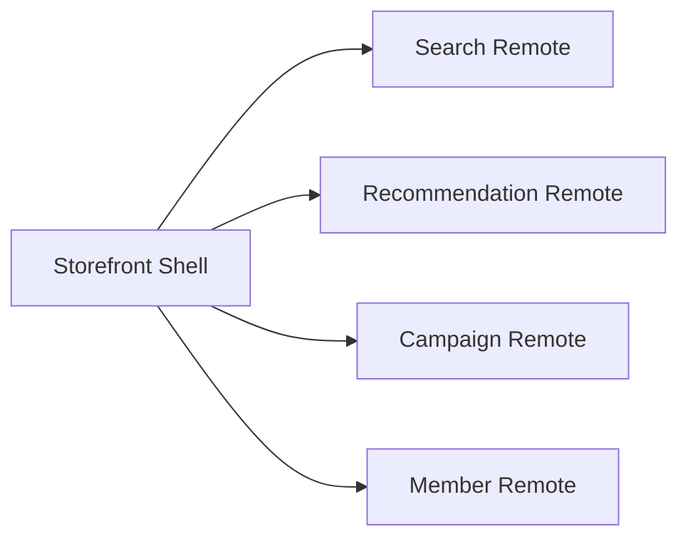

但它會增加：

* Remote Entry 管理
* Shared Dependency 衝突
* React 版本相容風險
* SSR 整合難度
* Runtime 故障風險
* 前端監控複雜度

建議原則：

```text
跨頁面與完整業務流程
    → Route-based Micro Frontend

同一頁面內需要獨立 Runtime 發布的模組
    → 再考慮 Module Federation
```

---

# 四、Monorepo 如何結合高流量與高併發？

## 1. Monorepo 本身不會提升正式環境承載能力

Monorepo 解決：

* 程式碼管理
* 套件重用
* Build Pipeline
* Dependency Graph
* 工程規範
* CI/CD 效率

高流量、高併發主要由以下機制處理：

* CDN
* Edge Cache
* WAF
* Rate Limiting
* Load Balancer
* Horizontal Scaling
* Redis
* BFF
* Message Queue
* Circuit Breaker
* Graceful Degradation

---

## 2. momo 高流量 Runtime 架構

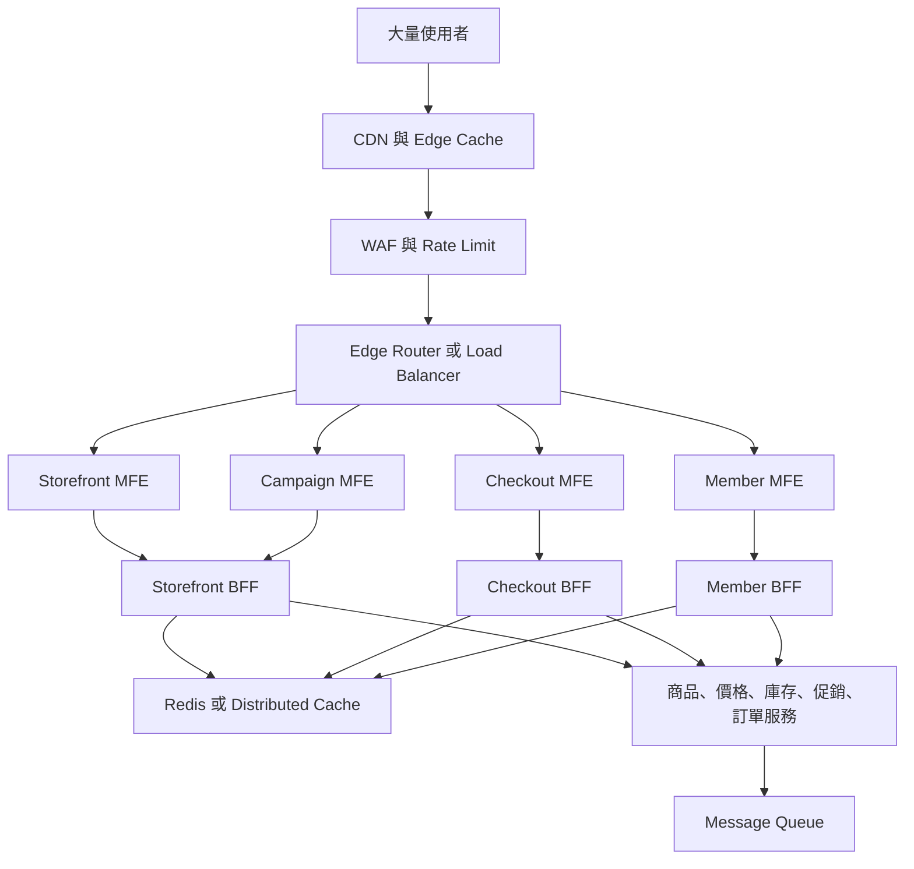

---

## 3. CDN 與 Edge Cache 優先承接讀取流量

大型促銷活動期間，大部分流量集中在：

* 首頁
* 活動頁
* 商品列表
* 商品圖片
* JavaScript
* CSS
* 字型
* SEO 頁面

應盡量由 CDN 回應：

```text
使用者
   ↓
CDN Cache Hit
   ↓
直接回傳內容
   ↓
不進入 Next.js Origin Server
```

建議策略：

| 內容            | Cache 策略                      |
| ------------- | ----------------------------- |
| Hash JS / CSS | 長時間 immutable cache           |
| 商品圖片          | CDN 長快取                       |
| 活動 Banner     | CDN Cache 配合 Purge            |
| 商品描述          | ISR 或中長時間快取                   |
| 商品列表          | 短時間快取                         |
| 商品價格          | 短 TTL 或即時更新                   |
| 庫存            | 即時 API                        |
| 購物車           | User-specific，不做 Shared Cache |
| 結帳結果          | 不快取                           |

---

## 4. 靜態內容與動態內容分離

商品頁不是所有內容都需要即時取得。

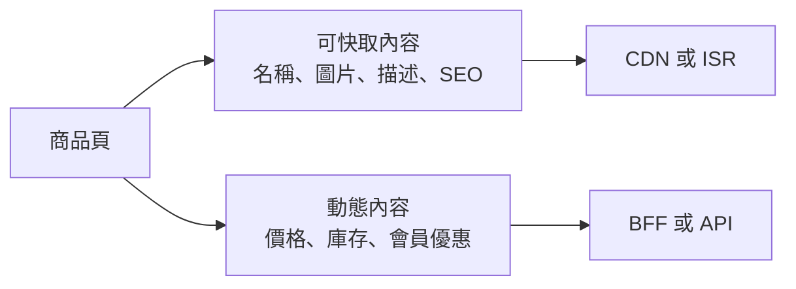

例如：

| 商品資料         | 建議            |
| ------------ | ------------- |
| 商品名稱         | 可快取           |
| 商品描述         | 可快取           |
| 商品圖片         | CDN 長快取       |
| SEO Metadata | 可快取           |
| 推薦商品         | 短快取           |
| 價格           | 短 TTL 或即時更新   |
| 庫存           | 即時查詢          |
| 會員優惠         | User-specific |

這樣可避免每次請求都重新計算完整頁面。

---

## 5. Micro Frontend 可獨立水平擴展

雙 11 期間，各系統承受的流量不同：

```text
Campaign 流量上升 20 倍
Storefront 流量上升 10 倍
Checkout 流量上升 5 倍
Member 流量上升 2 倍
Merchant 流量變化不大
```

拆成不同 Application 後，可以獨立擴展：

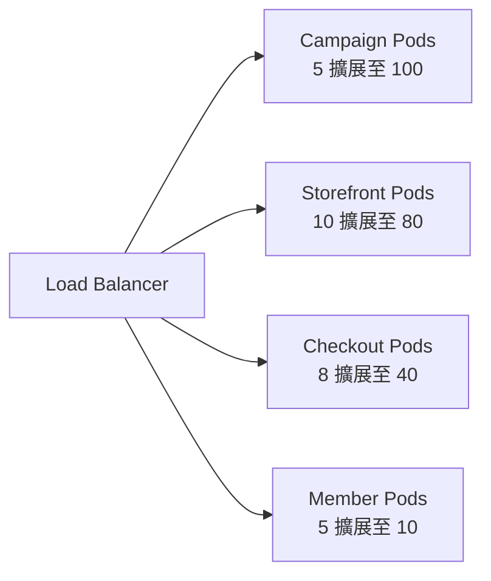

這比把所有功能放在單一 Application 更有效率。

---

## 6. BFF 降低 Browser 對後端的耦合

商品頁可能需要呼叫：

* Product Service
* Pricing Service
* Inventory Service
* Promotion Service
* Recommendation Service
* Review Service

不建議 Browser 直接呼叫所有內部服務。

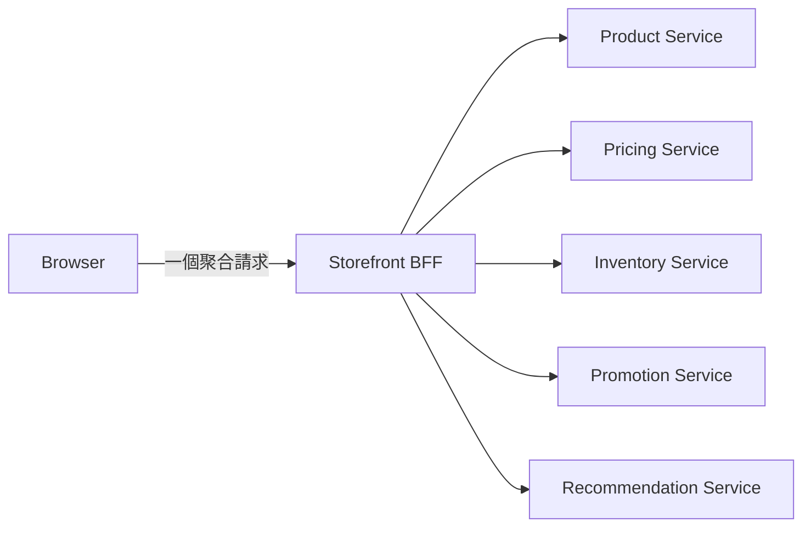

BFF 可以負責：

* API Aggregation
* Response Transformation
* Authentication
* Cache
* Timeout
* Retry
* Circuit Breaker
* Fallback
* Frontend-specific DTO

---

## 7. 高流量期間需要 Graceful Degradation

大型系統的目標不是所有功能永遠百分之百正常，而是：

> 非核心服務失敗時，核心交易流程仍能使用。

| 功能    | 失敗時策略         |
| ----- | ------------- |
| 推薦商品  | 隱藏推薦區塊        |
| 商品評論  | 顯示稍後載入        |
| 瀏覽紀錄  | 改成非同步寫入       |
| 個人化推薦 | 回退熱門商品        |
| 行銷追蹤  | 寫入 Queue      |
| 搜尋建議  | 暫停 Suggestion |
| 商品圖片  | 顯示預設圖         |
| 購物車   | 核心功能，必須維持     |
| 結帳    | 核心功能，必須維持     |
| 付款    | 失敗時不可重複扣款     |

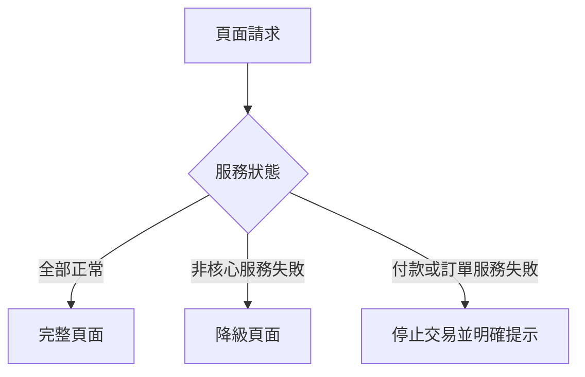

---

# 五、Monorepo 如何支援獨立 CI/CD？

## 1. Same Repository 不等於 Same Deployment

即使所有 App 都放在同一個 Repository：

```text
apps/storefront
apps/campaign
apps/checkout
apps/member
```

仍然可以產生不同 Image：

```text
storefront-image:v1.8.3
campaign-image:v2.4.1
checkout-image:v3.1.0
member-image:v1.6.5
```

因此：

```text
Monorepo
不等於
Monolithic Deployment
```

---

## 2. 只測試與建置受影響範圍

假設修改：

```text
packages/checkout-components
```

受影響：

```text
packages/checkout-components
apps/checkout
```

不受影響：

```text
apps/storefront
apps/member
apps/merchant
```

可執行：

```bash
pnpm turbo run lint typecheck test build --affected
```

或：

```bash
pnpm turbo run build --filter=checkout...
```

---

## 3. 獨立 CI/CD 架構圖

```mermaid
flowchart LR
    CHANGE["Pull Request"]
    AFFECTED["Affected Detection"]
    QUALITY["Lint、Typecheck、Unit Test"]
    BUILD["Build"]
    E2E["E2E 與 Contract Test"]
    IMAGE["建立獨立 Docker Image"]
    CANARY["Canary Deployment"]
    PROD["Production"]

    CHANGE --> AFFECTED
    AFFECTED --> QUALITY
    QUALITY --> BUILD
    BUILD --> E2E
    E2E --> IMAGE
    IMAGE --> CANARY
    CANARY --> PROD
```

不同 App 可以有不同 Pipeline：

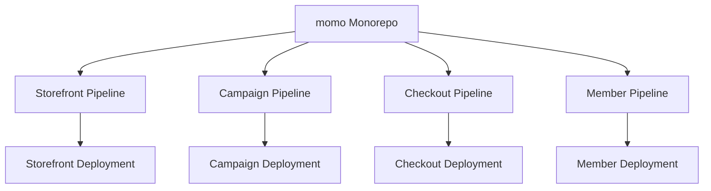

---

## 4. Remote Cache 提升團隊與 CI 效率

```text
Developer A 完成 @momo/ui Build
               ↓
          Remote Cache
               ↓
Developer B 與 CI 直接使用相同結果
```

適合快取：

* TypeScript Build
* ESLint
* Unit Test
* Storybook Build
* Next.js Build
* Generated API Client

需要注意：

> 所有會影響輸出的 Input、Environment Variable 與設定檔，都必須正確宣告，否則可能錯誤命中舊快取。

---

## 5. 使用 `turbo prune` 建立精簡部署內容

若只部署 Checkout：

```bash
turbo prune checkout --docker
```

原始 Repository：

```text
momo-commerce/
├── storefront
├── campaign
├── checkout
├── member
├── merchant
└── packages
```

Prune 後只保留：

```text
checkout-build-context/
├── checkout
├── ui
├── checkout-components
├── auth
├── api-client
└── api-contracts
```

可以：

* 減少 Docker Build Context
* 加速 Dependency Installation
* 提高 Docker Layer Cache 命中率
* 減少 Docker Image 內容
* 避免攜帶無關程式碼

---

# 六、momo 最終整合架構

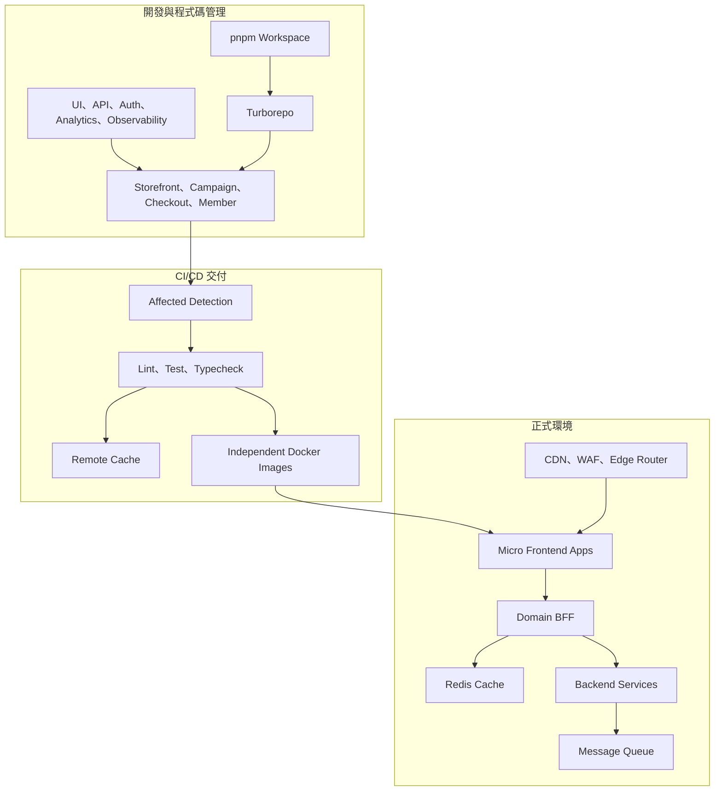

整體資料流：

```text
開發者修改程式碼
        ↓
pnpm 管理 Workspace 與套件依賴
        ↓
Turborepo 判斷受影響專案
        ↓
執行 Lint、Test、Typecheck、Build
        ↓
各 Application 產生自己的 Docker Image
        ↓
獨立部署成 Micro Frontend
        ↓
CDN 與 Edge Router 分配流量
        ↓
BFF 聚合後端服務
        ↓
Redis、水平擴展與降級機制承受高流量
```

---

# 七、核心結論

## 為什麼 Turborepo 常搭配 pnpm？

pnpm 提供：

1. Workspace 管理
2. Dependency Installation
3. Internal Package Linking
4. `workspace:` Protocol
5. 嚴格 Dependency Isolation
6. Content-addressable Store
7. 統一 Lockfile

Turborepo 提供：

1. Task Graph
2. Package Graph
3. Parallel Execution
4. Incremental Build
5. Local Cache
6. Remote Cache
7. Affected Detection
8. CI/CD 最佳化

兩者結合後：

```text
pnpm 管依賴
+
Turborepo 管任務
=
可擴展的 Monorepo 工程架構
```

---

## momo Monorepo 應如何設計？

```text
apps
    = 可獨立執行、部署及擴展的 Application

packages
    = 可被多個 Application 重用的 Internal Package

tooling
    = 統一 ESLint、TypeScript、Test 與格式規範
```

Application 應依照 Business Domain 拆分：

```text
Storefront
Campaign
Checkout
Member
Merchant
CMS
```

---

## Monorepo 如何結合 Micro Frontend？

```text
Monorepo
    → 統一程式碼、依賴與工程治理

Micro Frontend
    → 拆分團隊、Application 與部署單位

Route-based Composition
    → 依照 URL Path 分派不同 Application

Module Federation
    → 僅在同頁面需要獨立 Runtime 模組時使用
```

---

## Monorepo 如何結合高流量與高併發？

Monorepo 不直接承受流量。

正式環境由以下架構處理：

```text
CDN
WAF
Edge Router
Micro Frontend
BFF
Redis
Horizontal Scaling
Message Queue
Circuit Breaker
Graceful Degradation
```

Monorepo 的價值是讓這些 Application：

* 可以共用底層能力
* 保持一致的品質標準
* 只建置受影響的部分
* 各自產生 Docker Image
* 各自部署與擴展
* 降低大型團隊的協作成本

---

# 八、面試回答版本

> Turborepo 並沒有強制搭配 pnpm，它也可以使用 npm、Yarn 或 Bun。大型 Monorepo 經常選擇 pnpm，是因為 pnpm 提供原生 Workspace、`workspace:` Protocol、較嚴格的依賴隔離及 Content-addressable Store，可以降低 Phantom Dependency、磁碟占用與安裝成本。Turborepo 則建立在 Workspace 的套件關係上，負責 Task Graph、平行執行、Affected Detection 與 Remote Cache。
>
> 以 momo 這類大型電商為例，我會依照 Storefront、Campaign、Checkout、Member、Merchant 等 Business Domain 拆分可獨立部署的 Application，並將 Design Token、UI、API Contract、Authentication、Analytics 與 Observability 抽成 Internal Packages。
>
> Monorepo 負責 Source Code 與 Engineering Governance；Micro Frontend 負責 Team Ownership、Independent Deployment 與 Failure Isolation；高流量及高併發則由 CDN、Edge Routing、BFF、Redis、水平擴展、Circuit Breaker 及 Graceful Degradation 處理。
>
> 即使所有 Application 位於同一個 Repository，也必須維持獨立的 Build Pipeline、Docker Image、Deployment 與 Scaling Policy。因此 Monorepo 不等於 Monolithic Deployment。
