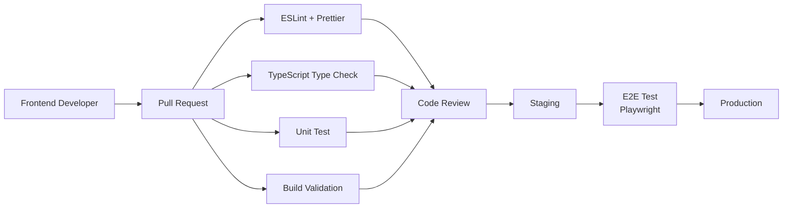
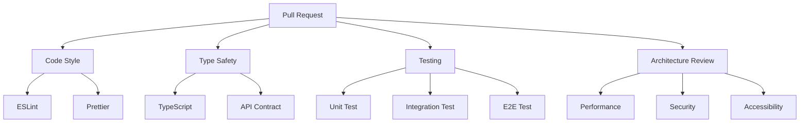
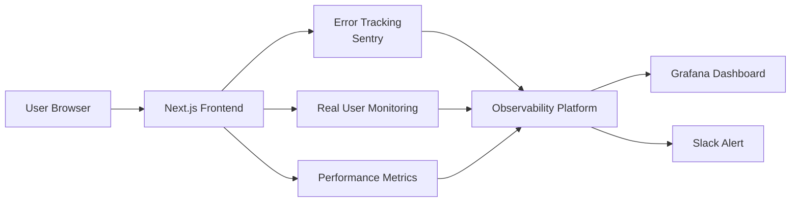
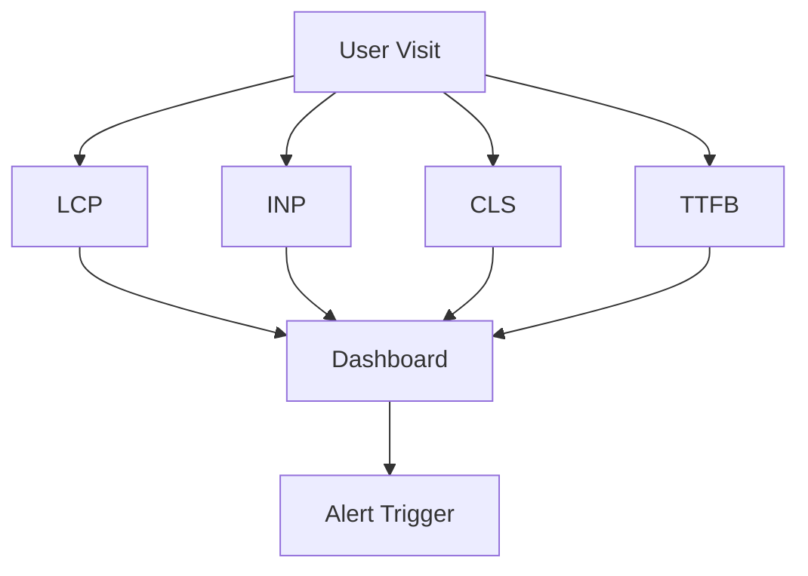
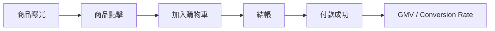
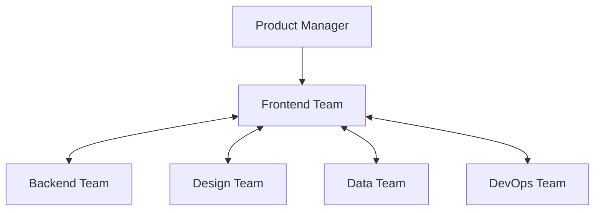
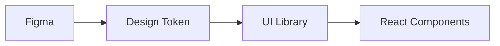
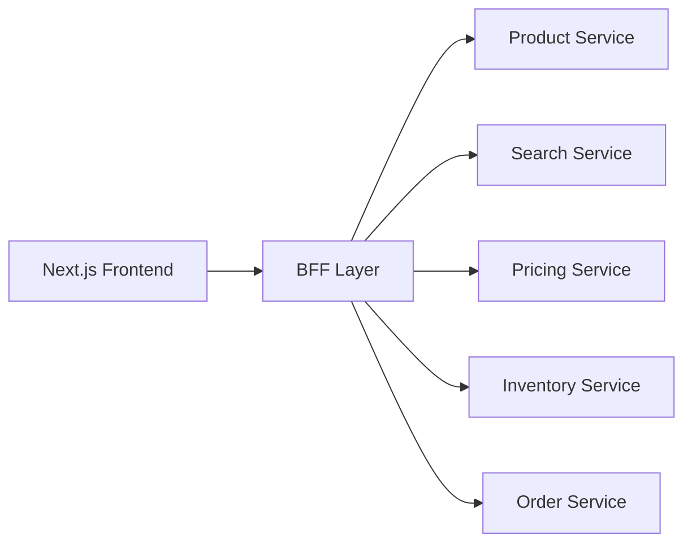
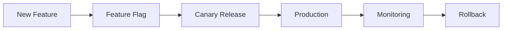

# momo 電商前端工程化、Observability 與跨職能協作架構圖

# 1. 現代化前端開發流程 (CI/CD + Quality Gate)

---

# 2. 品質機制 (Quality Gate)

---

# 3. Frontend Observability 架構

---

# 4. Core Web Vitals 監控

---

# 5. momo 商品購買漏斗監控

---

# 6. 跨職能合作架構

---

# 7. Design System 建設

---

# 8. API Contract 與 BFF 架構

---

# 9. 雙11大型活動部署策略

