# momo 大型電商前端：技術債改善架構圖（面試簡報版）

> 使用情境：面試時快速說明大型電商前端如何改善架構、State、API 與工程流程。  
> 技術假設：React、Next.js App Router、TypeScript、Monorepo。

---

# 一頁總覽

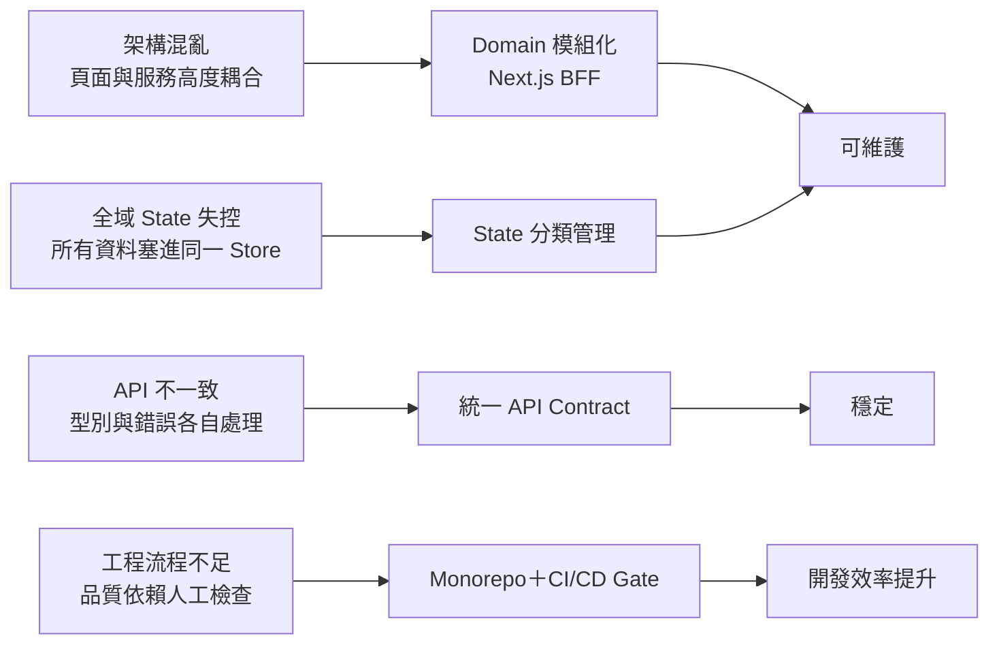

## 面試說法

> 我不會把大型電商技術債理解成單純整理程式碼，而是分成架構邊界、State 管理、API 契約與工程流程四個層次處理。

---

# 1. 架構設計改善

## 改善前

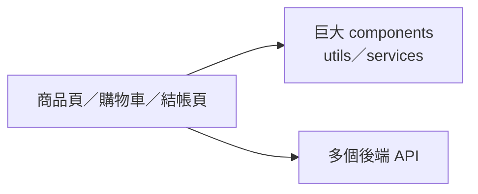

問題：

- 頁面直接依賴多個 API。
- 共用程式碼沒有商業邊界。
- 修改價格或促銷邏輯容易影響多個頁面。

## 改善後

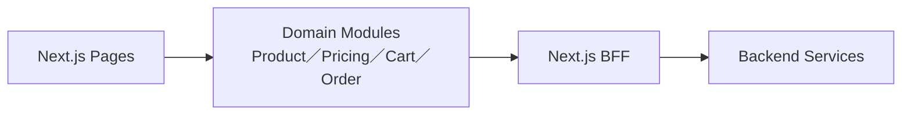

### 核心做法

- 按商品、價格、促銷、購物車與訂單切分 Domain。
- 頁面只負責組裝，不直接處理複雜商業邏輯。
- BFF 負責 API 聚合、資料轉換、權限與錯誤處理。
- Server Component 負責資料與 SEO；Client Component 只負責互動。

### 面試重點

> 架構改善的目標不是增加更多資料夾，而是讓每個商業領域有清楚責任，並控制模組之間的依賴方向。

---

# 2. 重構失控的全域 State

## 改善前

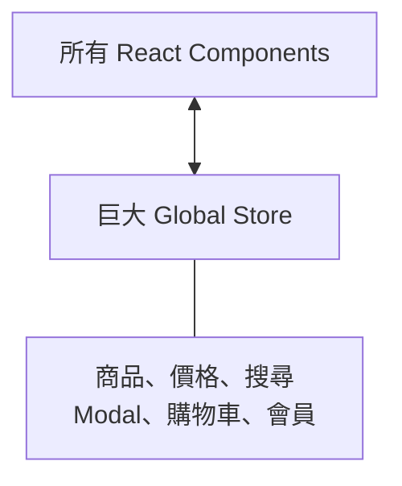

問題：

- Server State、URL State 與 UI State 混在一起。
- 容易發生重複資料與不必要 re-render。
- Store 成為跨模組溝通的捷徑。

## 改善後

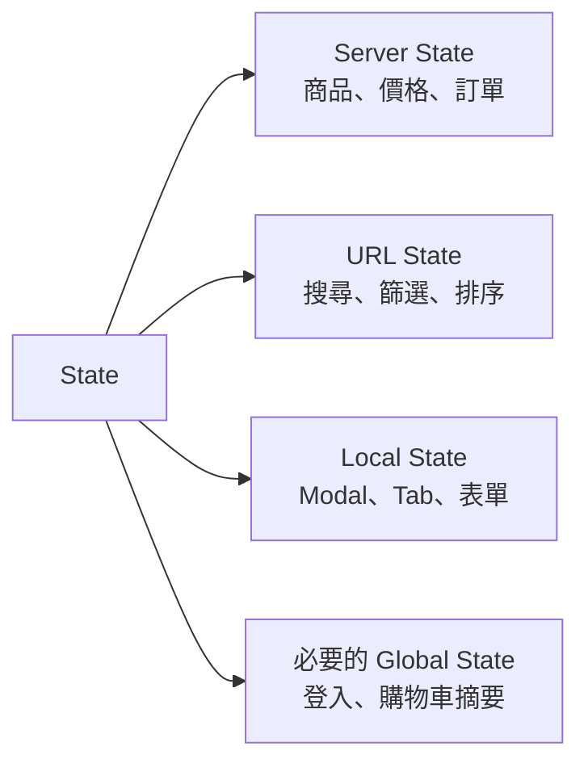

### momo 情境對照

| State 類型 | momo 範例 | 建議位置 |
|---|---|---|
| Server State | 商品、價格、庫存、訂單 | Server Component／Query Cache |
| URL State | 關鍵字、篩選、排序、頁碼 | Search Params |
| Local State | Tab、展開、圖片輪播 | `useState`／`useReducer` |
| Global State | 登入狀態、購物車摘要 | 小型 Context／Store |

### 面試重點

> 重構全域 State 不是換一套 State Library，而是先判斷資料的來源、生命週期與使用範圍，再決定它應該放在哪裡。

---

# 3. 統一 API Contract 與錯誤處理

## 改善前

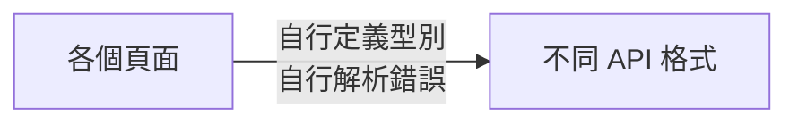

問題：

- 每個頁面自行定義 Response Type。
- API 欄位變動時，需要修改大量 Component。
- 登入失效、庫存不足與系統錯誤沒有統一處理。

## 改善後

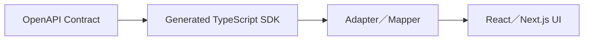

### 統一錯誤流程

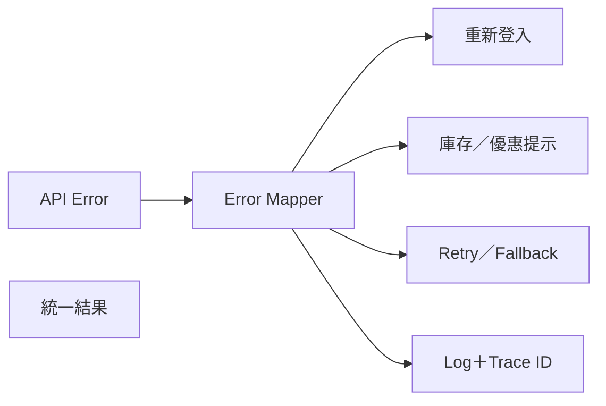

### 建議格式

```ts
type ApiResult<T> =
  | {
      success: true;
      data: T;
    }
  | {
      success: false;
      error: {
        code: string;
        message: string;
        retryable: boolean;
        traceId: string;
      };
    };
```

### 面試重點

> UI 不直接依賴後端原始 Response，而是透過 Generated Client 與 Adapter 轉成前端 Domain Model，降低前後端耦合。

---

# 4. Monorepo、模組化與 CI/CD Quality Gate

## Monorepo 結構

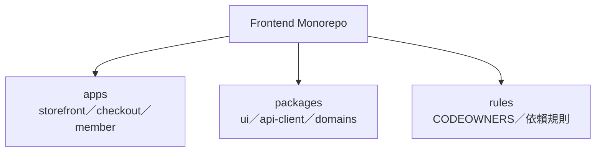

簡化目錄：

```text
apps/
├── storefront
├── checkout
└── member-center

packages/
├── ui
├── api-client
├── product-domain
├── cart-domain
└── eslint-config
```

## CI/CD Quality Gate

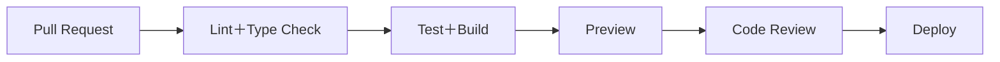

### Merge 前必須通過

| Quality Gate | 防止的問題 |
|---|---|
| ESLint＋Type Check | 基本程式與型別錯誤 |
| Unit／Component Test | 商業規則與元件回歸 |
| Build Check | 無法正式建置 |
| Dependency Boundary | Domain 任意互相引用 |
| Bundle Size Check | JavaScript 持續膨脹 |
| Preview Environment | PM、設計與 QA 無法提前驗收 |
| CODEOWNERS Review | 跨模組修改沒有人負責 |

### 面試重點

> 工程化的核心，是把架構規範從文件與口頭約定，轉成 Pull Request 必須自動通過的規則。

---

# 最後總結

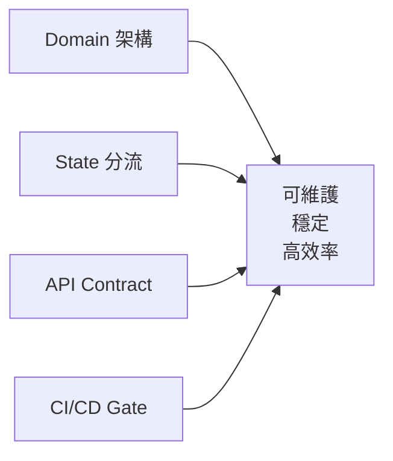

## 30 秒總結說法

> 針對 momo 這類大型電商，我會先建立商品、價格、促銷、購物車與訂單的 Domain Boundary，再透過 Next.js BFF 隔離後端服務。State 則依 Server、URL、Local 與必要 Global State 分流；API 使用 OpenAPI、Generated SDK 與統一錯誤模型。最後透過 Monorepo、依賴規則與 CI/CD Quality Gate，讓架構規範可以自動被執行，而不是只依賴工程師人工把關。

---

# 參考文件

- Next.js Server and Client Components  
  <https://nextjs.org/docs/app/getting-started/server-and-client-components>
- Redux Toolkit with Next.js  
  <https://redux.js.org/usage/nextjs>
- OpenAPI Specification  
  <https://spec.openapis.org/oas/>
- Turborepo CI  
  <https://turborepo.com/repo/docs/crafting-your-repository/constructing-ci>
