# momo 大型電商前端：技術債改善架構說明圖

> 適用情境：以 **React + Next.js App Router + TypeScript** 為主要技術框架，說明大型電商前端如何逐步改善架構、State、API Contract、Monorepo 與 CI/CD。  
>
> 本文件是依大型電商需求所做的架構設計示意，並非宣稱 momo 內部目前一定採用完全相同的實作。

---

## 閱讀方式

本文件拆成五張圖：

1. 技術債治理整體總覽
2. 架構設計改善
3. 重構失控的全域 State
4. 統一 API Contract 與錯誤處理
5. Monorepo、模組化管理與 CI/CD Quality Gate

將五張圖分開的原因，是避免把「執行架構、資料狀態、API 邊界、Repository 與交付流程」混在同一張圖，導致責任邊界反而不清楚。

---

# 0. 技術債治理整體總覽

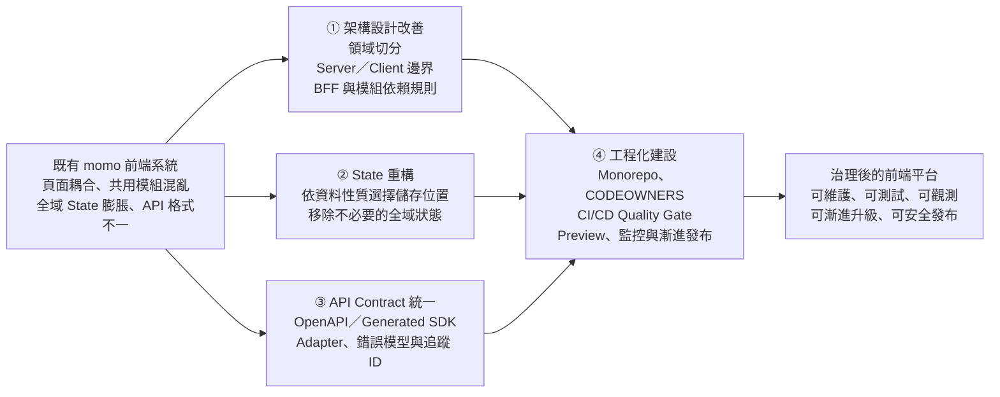

## 四項改善之間的關係

| 改善項目 | 解決的核心問題 | 最終產出 |
|---|---|---|
| 架構設計改善 | 頁面、元件與商業領域互相耦合 | 清楚的 Domain Boundary 與依賴方向 |
| State 重構 | 所有資料都被塞入同一個全域 Store | State 按生命週期與責任重新分配 |
| API Contract 統一 | 每個頁面自行解析 API、錯誤格式不一致 | Generated Client、Adapter 與標準錯誤模型 |
| Monorepo＋CI/CD | 規則只存在於工程師腦中 | 由工具自動執行的品質與發布管控 |

---

# 1. 架構設計改善

## 1.1 改善前：頁面直接耦合服務與共用模組

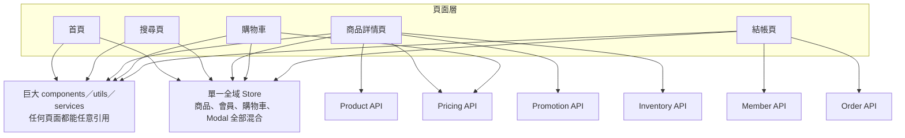

### 改善前的風險

- 頁面直接理解多個後端服務的欄位與錯誤格式。
- 共用資料夾沒有邊界，任何 Domain 都可以互相引用。
- 商業邏輯散落在 React Component、Hook、Store 與 API callback。
- 修改促銷或價格邏輯時，可能同時影響商品頁、購物車與結帳。
- 難以判斷某段程式碼應由哪個團隊負責。

---

## 1.2 改善後：依照商業領域切分，並建立受控依賴

```mermaid
flowchart TB
    Browser["使用者瀏覽器"]

    subgraph NextApp["Next.js Web Application"]
        subgraph Routes["Route／Page Composition"]
            HomePage["首頁"]
            SearchPage["搜尋頁"]
            ProductPage["商品詳情頁"]
            CartPage["購物車"]
            CheckoutPage["結帳頁"]
        end

        subgraph Domains["Domain Modules"]
            Product["Product Domain<br/>商品呈現與商品 View Model"]
            SearchD["Search Domain<br/>搜尋、篩選與排序"]
            Pricing["Pricing Domain<br/>價格顯示規則"]
            Promotion["Promotion Domain<br/>優惠呈現規則"]
            CartD["Cart Domain<br/>購物車行為"]
            CheckoutD["Checkout Domain<br/>結帳流程"]
            Member["Member Domain<br/>會員身分與權限"]
        end

        subgraph Shared["Shared Platform"]
            UI["Design System／UI Primitives"]
            APIClient["Generated API Client"]
            Analytics["Analytics／Tracking"]
            Observability["Logging／Metrics／Tracing"]
            FeatureFlag["Feature Flags"]
        end

        BFF["Next.js BFF／Route Handler<br/>API 聚合、授權、Adapter<br/>Timeout、Fallback、Cache Policy"]
    end

    subgraph Services["後端領域服務"]
        ProductService["Product Service"]
        SearchService["Search Service"]
        PricingService["Pricing Service"]
        InventoryService["Inventory Service"]
        PromotionService["Promotion Service"]
        CartService["Cart Service"]
        MemberService["Member Service"]
        OrderService["Order Service"]
        PaymentService["Payment Service"]
    end

    Browser --> Routes

    HomePage --> Product
    SearchPage --> SearchD
    ProductPage --> Product
    ProductPage --> Pricing
    ProductPage --> Promotion
    CartPage --> CartD
    CheckoutPage --> CheckoutD

    Product --> UI
    SearchD --> UI
    Pricing --> UI
    Promotion --> UI
    CartD --> UI
    CheckoutD --> UI

    Product --> BFF
    SearchD --> BFF
    Pricing --> BFF
    Promotion --> BFF
    CartD --> BFF
    CheckoutD --> BFF
    Member --> BFF

    BFF --> APIClient
    BFF --> ProductService
    BFF --> SearchService
    BFF --> PricingService
    BFF --> InventoryService
    BFF --> PromotionService
    BFF --> CartService
    BFF --> MemberService
    BFF --> OrderService
    BFF --> PaymentService

    Routes --> Analytics
    BFF --> Observability
    Routes --> FeatureFlag
```

## 1.3 建議依賴規則

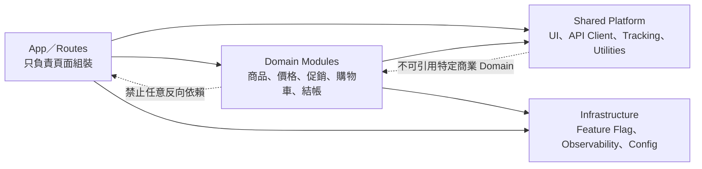

### 核心原則

- `app/routes`：負責組合頁面，不放複雜商業規則。
- `domains`：封裝特定領域的元件、型別、Use Case、Mapper 與資料存取介面。
- `shared`：只能放真正跨 Domain 且穩定的能力。
- Domain 之間若需要合作，應透過公開介面，不直接存取彼此內部檔案。
- Server Component 適合資料取得與不需瀏覽器互動的內容；Client Component 只包住需要 state、effect、事件或瀏覽器 API 的互動區塊。

---

# 2. 重構失控的全域 State

## 2.1 改善前：所有狀態都塞進同一個 Store

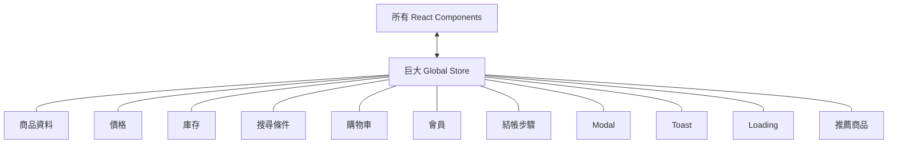

### 常見後果

- 任一 action 都可能造成大量不必要 re-render。
- Server State、URL State、UI State 與交易狀態混在一起。
- 同一份資料可能同時存在 Server Component、Query Cache 與 Global Store。
- 重新整理後狀態消失，或 hydration 時 Client 與 Server 狀態不一致。
- Store 成為跨 Domain 溝通的捷徑，模組邊界逐漸失效。

---

## 2.2 改善後：按狀態性質分流

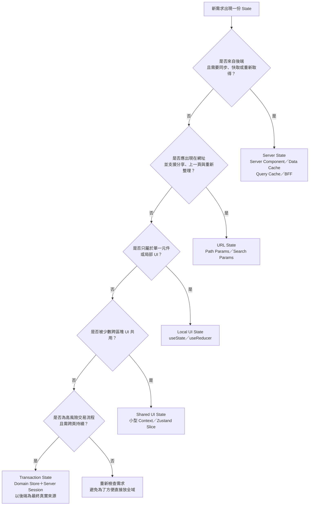

## 2.3 momo 情境對照

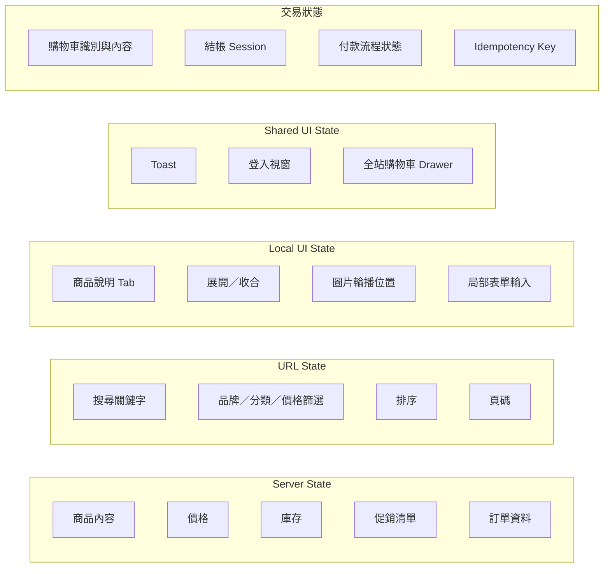

## 2.4 State 重構順序

1. 盤點 Store 中的所有欄位、action、selector 與使用頁面。
2. 標記每份 State 的擁有者、生命週期與真實來源。
3. 先移除最明顯的 Local UI State。
4. 將搜尋與篩選移入 URL。
5. 將後端資料移回 Server Component、Data Cache 或 Query Cache。
6. 將剩餘 Global State 拆成依 Domain 負責的小型 Slice。
7. 使用 memoized selector，只訂閱元件真正需要的最小資料。
8. 透過 Feature Flag 漸進切換，避免一次重寫整個 Store。

---

# 3. 統一 API Contract 與錯誤處理

## 3.1 改善前：每個頁面自行處理 API

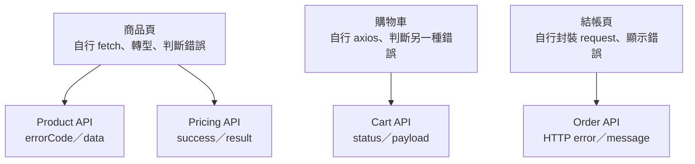

### 主要問題

- API response type 被不同頁面重複定義。
- 後端欄位改名時，需要修改大量 Component。
- HTTP status、商業錯誤與系統錯誤混在一起。
- 無法一致判斷是否可 retry、是否需重新登入、是否應降級。
- 前端錯誤無法透過 trace ID 對應後端 log。

---

## 3.2 改善後：Contract First＋Generated Client＋Adapter

```mermaid
flowchart LR
    subgraph Backend["後端服務"]
        APIImplementation["Product／Pricing／Cart／Order API"]
        ErrorCatalog["統一 Error Catalog<br/>錯誤碼、HTTP Status、可否重試"]
    end

    Contract["OpenAPI Contract<br/>Schema、Endpoint、Error Response"]

    Generator["Code Generation<br/>TypeScript Types＋API Client"]

    subgraph FrontendPlatform["前端平台層"]
        GeneratedSDK["Generated SDK<br/>禁止手動修改"]
        Interceptor["HTTP Interceptor<br/>Auth、Timeout、Trace ID"]
        Adapter["Domain Adapter／Mapper<br/>API DTO → Domain Model"]
        ErrorMapper["Error Mapper<br/>API Error → FrontendError"]
        Repository["Domain Repository"]
    end

    subgraph UI["Next.js／React"]
        ServerComponent["Server Component／BFF"]
        ClientInteraction["Client Interaction"]
        ErrorBoundary["Error Boundary／Fallback UI"]
        UserMessage["使用者可理解的錯誤訊息"]
        Monitoring["Logging／Metrics／Tracing"]
    end

    APIImplementation --> Contract
    ErrorCatalog --> Contract
    Contract --> Generator
    Generator --> GeneratedSDK

    GeneratedSDK --> Interceptor
    Interceptor --> Adapter
    Interceptor --> ErrorMapper
    Adapter --> Repository
    ErrorMapper --> Repository

    Repository --> ServerComponent
    Repository --> ClientInteraction

    ServerComponent --> ErrorBoundary
    ClientInteraction --> ErrorBoundary
    ErrorBoundary --> UserMessage
    ErrorBoundary --> Monitoring
```

## 3.3 建議標準回傳模型

```ts
export type ApiSuccess<T> = {
  success: true;
  data: T;
  meta?: {
    traceId: string;
    timestamp: string;
  };
};

export type ApiFailure = {
  success: false;
  error: {
    code: string;
    message: string;
    category:
      | "VALIDATION"
      | "AUTHENTICATION"
      | "AUTHORIZATION"
      | "BUSINESS"
      | "DEPENDENCY"
      | "SYSTEM";
    retryable: boolean;
    traceId: string;
  };
};

export type ApiResult<T> = ApiSuccess<T> | ApiFailure;
```

## 3.4 前端錯誤處理決策

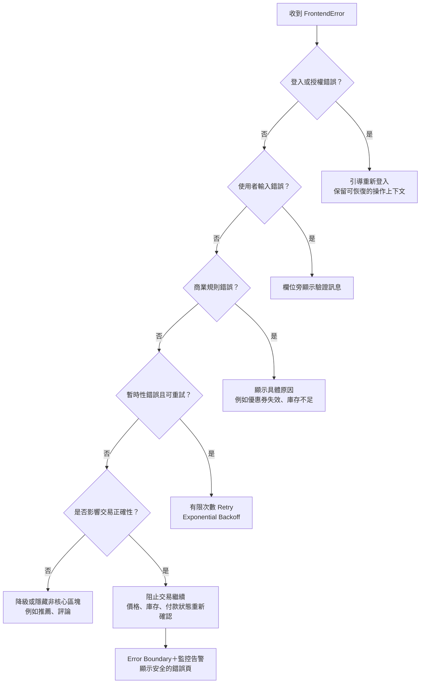

### 不同服務的降級策略

| 服務 | 失敗後建議處理 |
|---|---|
| Product | 無法確認商品主體，商品頁顯示錯誤狀態 |
| Pricing | 不顯示推測價格，暫停購買並重新取得 |
| Inventory | 暫停加入購物車或結帳，避免超賣 |
| Promotion | 不套用無法確認的優惠，顯示重新整理提示 |
| Recommendation | 隱藏推薦區，不應讓整個商品頁失敗 |
| Review | 顯示評論暫時無法載入 |
| Payment | 以訂單／付款服務查詢最終狀態，不可只看前端 timeout |

---

# 4. Monorepo、模組化管理與 CI/CD Quality Gate

## 4.1 Monorepo 結構

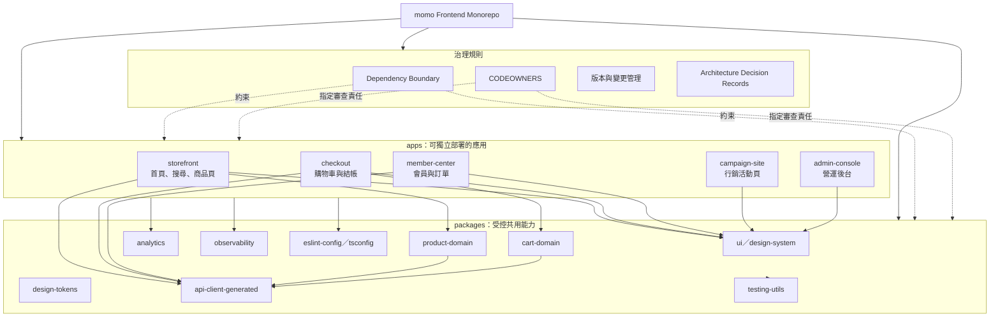

## 4.2 Pull Request Quality Gate

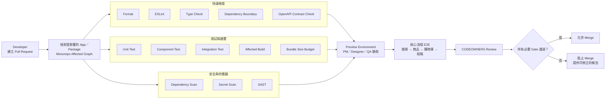

## 4.3 Deployment Quality Gate

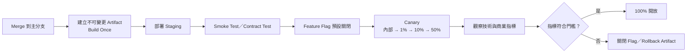

## 4.4 建議 Quality Gate

| Gate | 阻擋條件示例 | 目的 |
|---|---|---|
| Type Check | TypeScript error | 防止型別契約破壞 |
| Dependency Boundary | Domain 引用另一 Domain 私有模組 | 保護架構邊界 |
| Contract Check | OpenAPI breaking change 未標記 | 防止前後端契約無預警破壞 |
| Unit／Component Test | 核心規則或元件測試失敗 | 防止局部回歸 |
| E2E | 加入購物車或結帳流程失敗 | 保護營收關鍵路徑 |
| Bundle Budget | 關鍵頁面 JS 超過門檻 | 防止效能持續惡化 |
| Security Scan | 高風險漏洞或 secret 外洩 | 保護供應鏈與憑證 |
| CODEOWNERS | 缺少負責團隊核准 | 防止跨領域誤改 |
| Canary Metrics | Error rate、LCP、轉換率惡化 | 防止問題全面擴散 |

---

# 5. 四項技術債的建議導入順序

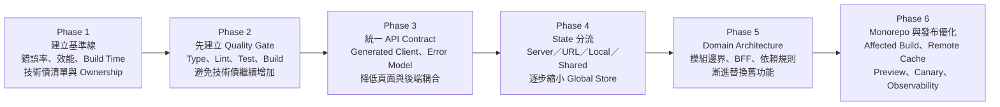

## 為什麼不是先全面重寫？

大型電商持續有商品瀏覽、促銷活動、購物車與交易流量，全面重寫容易產生以下風險：

- 舊系統中的隱性商業規則沒有被完整搬移。
- 新功能開發與重寫工作互相競爭資源。
- 缺少測試與監控時，無法判斷新舊版本差異。
- 問題發生後難以快速回滾。

因此較務實的方式是：

> **先建立監控與 Quality Gate，停止技術債繼續增加；再使用 Feature Flag、Adapter 與漸進替換方式處理高風險、高修改頻率的模組。**

---

# 6. 最終目標

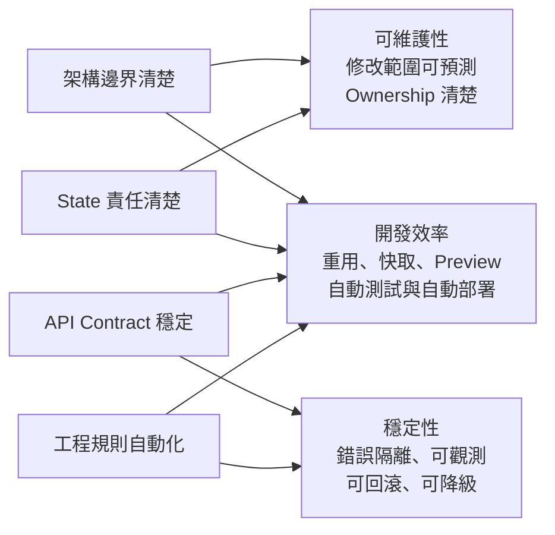

---

# 參考依據

- Next.js：Server Component 與 Client Component 的責任與組合方式  
  <https://nextjs.org/docs/app/getting-started/server-and-client-components>
- Next.js：App Router 資料取得  
  <https://nextjs.org/docs/app/getting-started/fetching-data>
- Redux：Next.js App Router 下的 State 管理建議  
  <https://redux.js.org/usage/nextjs>
- Redux：State 不應全部放入 Redux，應依使用範圍決定位置  
  <https://redux.js.org/tutorials/fundamentals/part-2-concepts-data-flow>
- Redux：保持 Store 最小化並透過 Selector 衍生資料  
  <https://redux.js.org/usage/deriving-data-selectors>
- OpenAPI Specification  
  <https://spec.openapis.org/oas/>
- Turborepo：Monorepo CI 與 Remote Cache  
  <https://turborepo.com/repo/docs/crafting-your-repository/constructing-ci>
- Turborepo：Task Cache  
  <https://turborepo.com/repo/docs/crafting-your-repository/caching>
