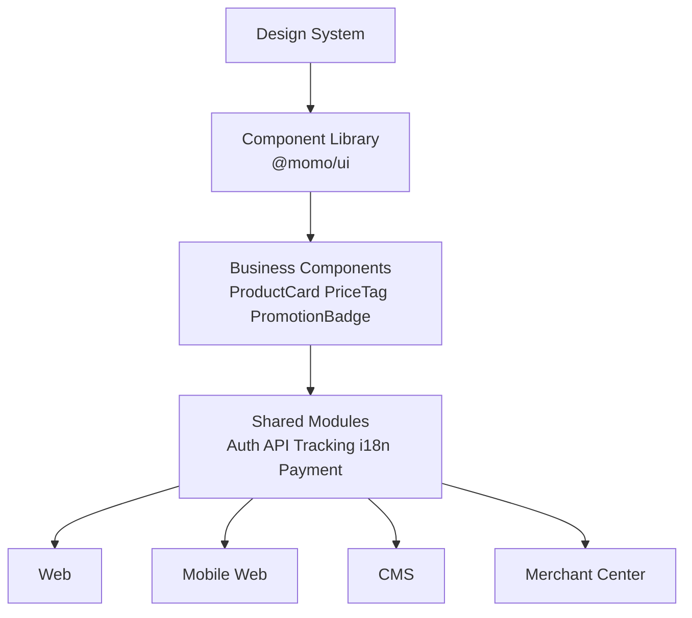
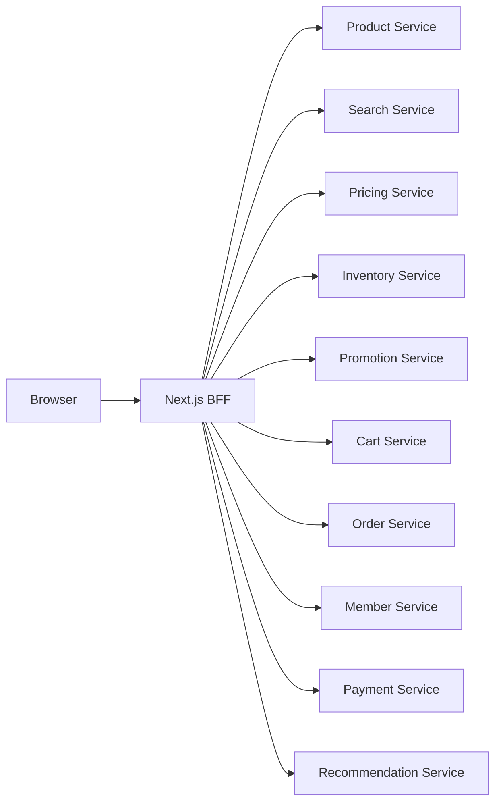
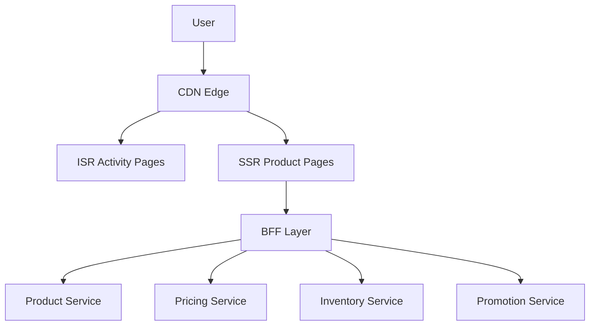

# momo 企業級 Frontend Architecture 實踐說明

## 1. Scalable Frontend Architecture



---

## 2. Monorepo 架構

```mermaid
flowchart TB

ROOT[momo-monorepo]

ROOT --> APPS
ROOT --> PACKAGES

APPS --> WEB[web]
APPS --> MWEB[mobile-web]
APPS --> CMS[cms]
APPS --> MERCHANT[merchant]

PACKAGES --> UI[@momo/ui]
PACKAGES --> BC[@momo/business-components]
PACKAGES --> AUTH[@momo/auth]
PACKAGES --> API[@momo/api-sdk]
PACKAGES --> TRACK[@momo/tracking]
PACKAGES --> I18N[@momo/i18n]
```

---

## 3. BFF 架構



### 優勢

- API Aggregation
- 減少 Frontend Round Trips
- 統一 Error Handling
- 統一 Authentication
- 降低瀑布式請求

---

## 4. 高流量促銷架構



### 場景

- 618
- 雙11
- 雙12
- 黑色星期五

### 優化策略

| 技術 | 用途 |
|--------|--------|
| SSR | SEO 與商品頁 |
| ISR | 活動頁快取 |
| CDN | 全球快取 |
| Dynamic Import | Code Splitting |
| React Window | Virtual List |
| Next Image | 圖片最佳化 |

---

## 5. 跨境與多語系架構

```mermaid
flowchart TD

I18N[@momo/i18n]

I18N --> TW[zh-TW]
I18N --> EN[en-US]
I18N --> JP[ja-JP]
I18N --> MY[ms-MY]

TW --> WEB[Web Site]
EN --> WEB
JP --> WEB
MY --> WEB
```

### 實作原則

```tsx
t("add_to_cart")
```

避免

```tsx
加入購物車
```

---

## 6. 面試總結

### 我會如何回答 momo 面試官

> 我會將 momo 視為 Frontend Platform，而非單一網站。
>
> 透過 Design System、Monorepo、Business Components、Shared Modules 建立可擴展架構；
>
> 利用 Next.js SSR/ISR、CDN、BFF、Code Splitting、Virtualization、Image Optimization 應對大型促銷流量；
>
> 最後透過 i18n 與模組化設計支援跨境站點與多語系需求，打造能支撐千萬會員規模的企業級前端平台。
