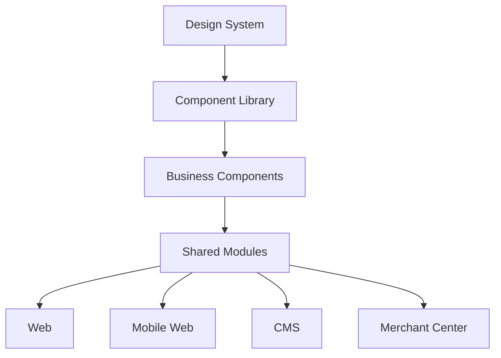
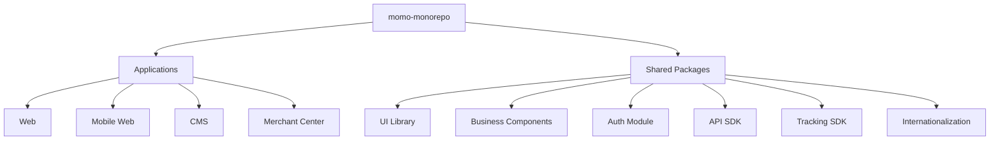
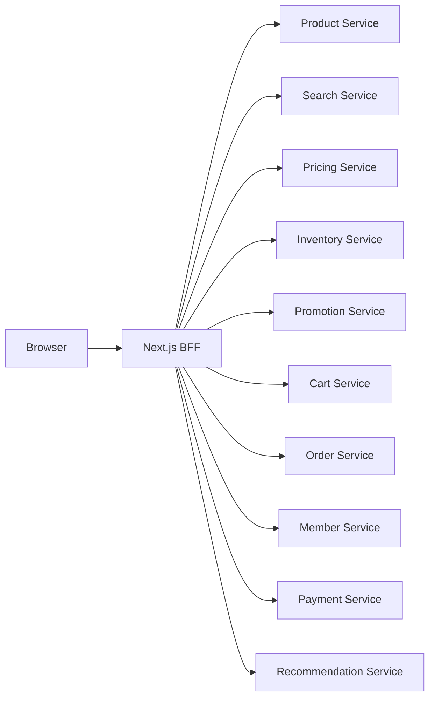
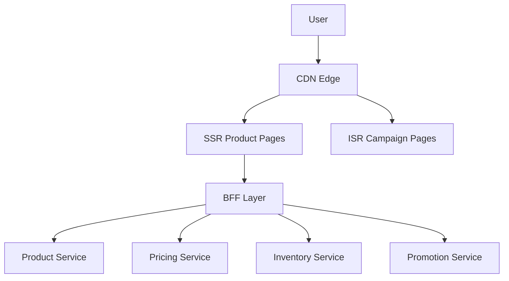
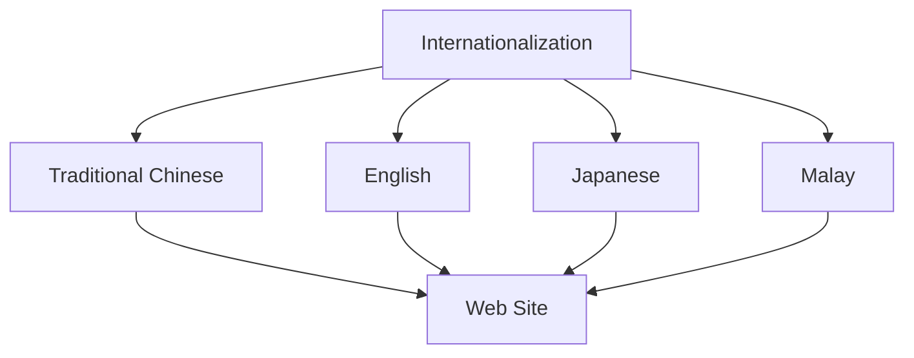
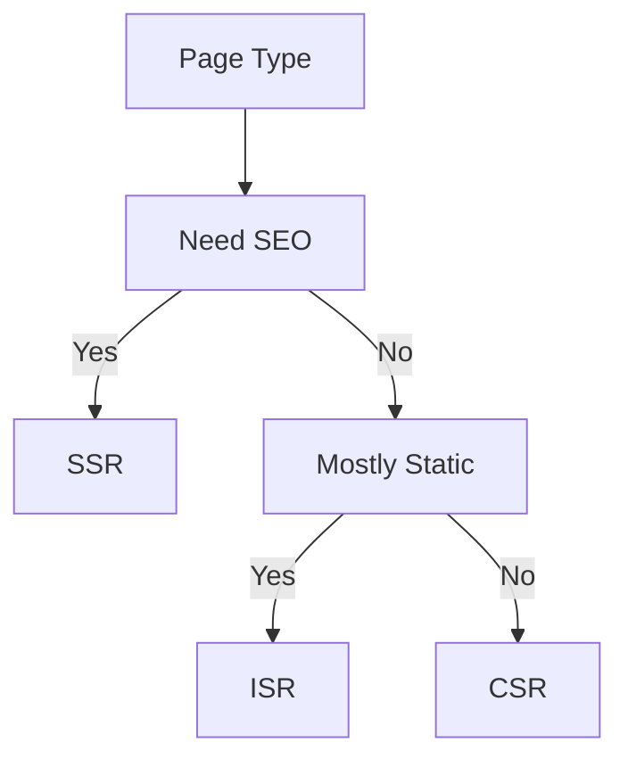
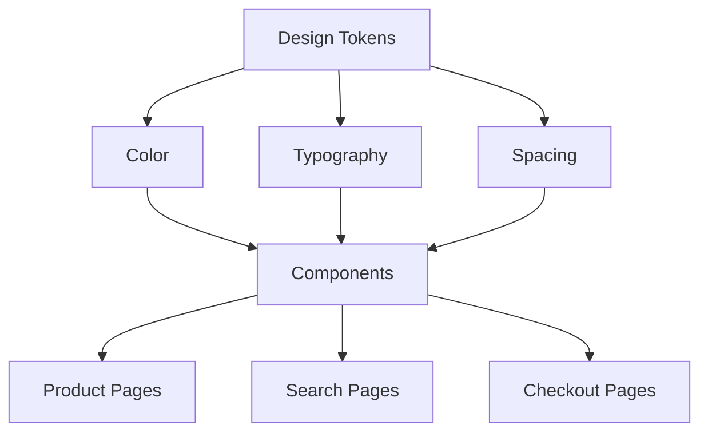

# momo Enterprise Frontend Architecture

## 1. Frontend Platform Architecture



---

## 2. Monorepo Architecture



---

## 3. BFF Architecture



---

## 4. High Traffic Architecture



### Traffic Scenarios

* 618 Shopping Festival
* Double 11
* Double 12
* Black Friday

### Optimization Strategy

| Technology         | Purpose               |
| ------------------ | --------------------- |
| SSR                | SEO and Product Pages |
| ISR                | Campaign Pages        |
| CDN                | Edge Cache            |
| Dynamic Import     | Code Splitting        |
| Virtualization     | Large Lists           |
| Image Optimization | Faster Image Loading  |

---

## 5. Internationalization Architecture



### Example

```tsx
t("add_to_cart")
```

Avoid:

```tsx
"加入購物車"
```

---

## 6. Frontend Technology Decision



---

## 7. Design System Layer



---

## Interview Summary

I would treat momo as a Frontend Platform rather than a single website.

Key capabilities:

* Design System
* Component Library
* Business Components
* Shared Modules
* Monorepo
* BFF Architecture
* SSR and ISR
* CDN Strategy
* Internationalization
* High Traffic Optimization

The goal is to support millions of users and large-scale promotional traffic while maintaining development efficiency and system scalability.

```
```
